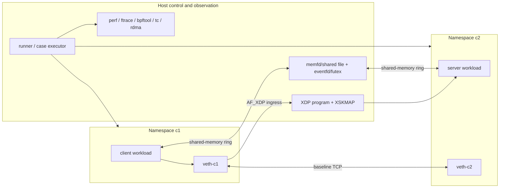
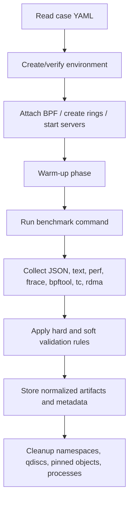

# Localhost Container Fast-Path Optimization Lab

## Executive summary

This project builds a **same-host container networking lab** that compares four datapath classes under one runner: a baseline `veth`/TCP path, an **AF_XDP** path, a **shared-memory ring** path, and an optional **Kubernetes + Cilium netkit** path. The earlier **virtio-net + RXE/SIW** work remains useful, but only as a control baseline for RDMA semantics and tooling, not as the main optimization target for same-host containers. The concrete engineering goal is to make optimization visible: not just “run benchmarks,” but build transports and datapaths that can actually remove host-stack work, namespace-switch overhead, or socket-path overhead, then validate them with repeatable tests and kernel-facing observability. AF_XDP provides a queue-bound socket with RX/TX rings over UMEM and an XDP/XSKMAP redirect path; libxdp is the current helper library for using AF_XDP from userspace. Cilium’s **netkit** mode is explicitly designed to replace `veth` and, with eBPF host-routing, reduce network-namespace datapath overhead for Pods; it requires kernel support and is documented as a performance-oriented configuration. RXE and SIW remain available through `rdma link add ... type rxe|siw netdev <DEVICE>` and perftest remains the standard verbs microbenchmark suite. citeturn10view0turn10view1turn11view0turn11view1turn11view2turn10view10turn17view0turn17view1turn10view5turn10view7

The recommended implementation path is deliberately staged. First, create a **minimal Linux network-namespace lab** that reproduces container-like networking with a `veth` pair and baseline TCP tools. Then add **AF_XDP** in `XDP_SKB` mode on those namespace links, because AF_XDP explicitly supports both `XDP_SKB` and `XDP_DRV`, and `XDP_SKB` is the generic fallback that works for any network device even though it is a copy path. After that, implement a **shared-memory message transport** using a RAM-backed shared mapping plus kernel-assisted wait/notify primitives. Linux provides exactly the primitives needed for that design: `memfd_create()` for an anonymous RAM-backed file, `eventfd()` for wait/notify counters, and `futex()` for mostly-userspace blocking synchronization. Finally, if the host kernel is new enough, add an optional **kind + Cilium netkit** profile to compare a production-quality optimized Pod datapath against plain `veth`. citeturn22search2turn10view16turn10view17turn10view18turn18search1turn17view0

The most relevant pre-existing projects to reuse are: **xdp-tools/libxdp** for AF_XDP helpers and XDP utilities; **xdp-project/bpf-examples** for AF_XDP example code, including shared-UMEM patterns; **xdp-project/xdp-tutorial**, especially the advanced AF_XDP lesson, as a learning baseline; **Cilium** for the optimized namespace datapath and Linux-network benchmark methodology; **rdma-core** and **perftest** for the control baseline; and **QEMU** if you want to keep the earlier VM-based RXE/SIW track alive in parallel. citeturn14search0turn14search1turn14search5turn23search1turn21view0turn10view5turn10view7turn10view8turn10view9

## Prerequisites and assumptions

### Assumptions

The following items are assumed to have **no specific constraint** unless you choose the optional profiles that impose one:

- exact CPU count  
- exact VM image  
- exact Linux distribution  
- exact NIC model  
- exact memory size beyond “enough to run two namespaces or a local cluster”

For the **minimal reproducible path**, a modern Linux host is enough. For the **optional Cilium netkit** profile, use a kernel with `CONFIG_NETKIT=y` and kernel **6.8 or newer**. For running BPF-heavy tooling or Cilium natively, recent kernels and a working LLVM/clang toolchain matter; the Cilium docs recommend Linux **5.10+** as a generally good baseline and document newer-kernel requirements for advanced features such as netkit. citeturn26view3turn16view6turn10view3turn17view0

### Required capabilities and host features

Creating new network namespaces generally requires elevated privilege, and unsharing a network namespace requires `CAP_SYS_ADMIN`. System-wide BPF installation is also documented by Cilium as requiring `CAP_SYS_ADMIN`, with the practical recommendation to run the agent as root or as a privileged container. If you use BPF object pinning and introspection, mount **bpffs** at `/sys/fs/bpf`; the Cilium system requirements document shows the canonical check and mount command. Trace collection should use **tracefs** at `/sys/kernel/tracing`. citeturn20search5turn26view2turn26view0turn26view1turn10view12

### Recommended host profile

| Category | Minimum practical baseline | Recommended for full lab | Notes |
|---|---|---|---|
| CPU | No specific constraint | 8 logical CPUs or more | Two isolated CPUs make latency tests easier to stabilize. |
| Memory | No specific constraint | 16 GiB or more | Shared-memory and kind/Cilium profiles become easier. |
| Kernel | Modern distro kernel | 6.8+ | Needed for optional netkit profile. |
| Filesystems | `bpffs`, `tracefs` mountable | mounted persistently | Needed for BPF pinning and tracing. |
| Privilege | root or equivalent privileged runner | root | Simplifies netns, BPF, perf, and optional Cilium work. |
| Timekeeping | no specific constraint | stable CPU governor | Strongly recommended for repeatable latency tests. |

The main kernel-side checks you should enforce are the general eBPF options documented by Cilium, plus `CONFIG_NETKIT=y` if you intend to use netkit. In practice, also verify `CONFIG_XDP_SOCKETS` before doing AF_XDP work, because AF_XDP depends on XDP sockets support. Cilium documents the more general BPF-related configuration set and the `CONFIG_NETKIT` requirement for netkit device mode. citeturn18search0turn16view6

### Example package set

The package names below are **Debian/Ubuntu-style examples**. Adjust as needed for other distributions.

```bash
sudo apt-get update
sudo apt-get install -y \
  build-essential clang llvm libelf-dev pkg-config cmake ninja-build make git jq \
  python3 python3-pip python3-venv \
  iproute2 iputils-ping ethtool net-tools socat numactl \
  iperf3 linux-tools-common linux-tools-generic "linux-tools-$(uname -r)" \
  bpftool trace-cmd rdma-core ibverbs-utils \
  docker.io helm
```

For `netperf`, build from source in a dedicated `external/` directory if your distribution does not package it cleanly. Cilium’s benchmark methodology uses **netperf** and describes the metric families around **TCP_STREAM**, **TCP_RR**, and **TCP_CRR**; iperf3 provides JSON output and zero-copy mode, which makes it useful for baseline throughput regression checks. citeturn21view0turn10view14turn25search2

### Host verification commands

```bash
uname -r
grep -E 'CONFIG_(BPF|BPF_SYSCALL|BPF_JIT|CGROUP_BPF|PERF_EVENTS|NETKIT|XDP_SOCKETS|NET_SCH_NETEM)=' \
  /boot/config-$(uname -r) || true

mount | grep /sys/fs/bpf || sudo mount bpffs /sys/fs/bpf -t bpf
mount | grep /sys/kernel/tracing || sudo mount -t tracefs tracefs /sys/kernel/tracing

bpftool version
perf version
rdma --version || true
```

## Project specification

### Scope, goals, and non-goals

The project is a **localhost fast-path optimization lab** for container-like workloads. Its unit of comparison is **message movement on the same host**, not wire-speed external networking. The lab must support the following datapaths:

| Datapath | Role in the lab | Primary tools | Expected measurement types |
|---|---|---|---|
| `tcp_veth` | baseline container path | `netperf`, `iperf3`, `perf`, `ftrace` | throughput, RR latency, CRR, CPU cost |
| `af_xdp_skb` | packet fast-path experiment | `libxdp`, `bpftool`, `perf`, `ftrace` | msg/s, RTT, drops, syscalls/msg, cycles/msg |
| `shm_ring` | strongest same-host optimization candidate | custom transport + `perf` | RTT, msg/s, cycles/msg, context switches |
| `cilium_netkit` | production-style optimized Pod datapath | kind + Helm + Cilium + `netperf` | TCP_STREAM, TCP_RR, TCP_CRR, CPU cost |
| `rxe_siw_vm_control` | previous-project control baseline | `rdma-core`, `perftest`, QEMU | verbs bandwidth/latency, semantic sanity |

This matrix is grounded in the upstream tool and datapath documentation: Cilium’s benchmark methodology explicitly uses **throughput**, **request/response**, and **connection rate** as benchmark families with **netperf**; AF_XDP explicitly exposes queue-oriented rings and XDP-program redirection; RXE and SIW are configured over a normal netdev; QEMU recommends **virtio** device models and uses TAP as the standard way to connect a guest NIC to the host. citeturn21view0turn10view0turn10view1turn10view5turn10view8turn10view9

The **hard goal** is correctness and repeatability. The **soft goal** is optimization. Hard pass conditions are: all setup steps succeed, all required namespaces or Pods come up, all tools emit parseable outputs, no silent data corruption occurs, and artifact capture is complete. Soft pass conditions are: the shared-memory ring reduces small-message latency and CPU cost relative to `tcp_veth`; AF_XDP reduces socket-path cost for packet-style workloads; and netkit lowers namespace-path overhead relative to `veth` in the optional Kubernetes profile. Cilium documents netkit and eBPF host-routing as performance-oriented mechanisms specifically meant to reduce host-stack and namespace-switch overhead; AF_XDP documents its XDP redirect path as bypassing the full network stack on the receive-to-userspace path. citeturn17view1turn17view2turn10view1turn22search2

### Relevant existing projects to reuse

| Project | Reuse strategy | Why it matters |
|---|---|---|
| `xdp-project/xdp-tools` | reuse `libxdp`, optionally `xdp-loader`, `xdp-dump`, `xdp-monitor` | Official AF_XDP/XDP helper library and utilities. |
| `xdp-project/bpf-examples` | copy AF_XDP example patterns, especially private/shared UMEM | Fastest route to a correct AF_XDP control/data path. |
| `xdp-project/xdp-tutorial` | use advanced AF_XDP lesson as a smoke baseline | Good learning scaffold before custom code. |
| `Cilium` | use netkit and benchmark methodology | Real optimized Pod datapath and established benchmark taxonomy. |
| `rdma-core` | keep RXE/SIW control baseline | Reuses prior lab and provides software-RDMA control cases. |
| `perftest` | run verbs-level control microbenchmarks | Standard RXE/SIW latency/bandwidth tools. |
| `QEMU` | optional VM profile | Clean way to preserve the previous virtio + RXE/SIW baseline. |

`xdp-tools` explicitly contains `libxdp`, `xdp-loader`, `xdp-bench`, `xdp-dump`, `xdp-forward`, and `xdp-monitor`; `bpf-examples` includes AF_XDP examples and shared-UMEM references; `xdp-tutorial` is organized to teach practical XDP development and includes advanced lessons; and Cilium’s benchmark chapter documents how it maps workload classes to benchmark tools and traffic patterns. citeturn14search0turn14search1turn14search5turn23search1turn21view0

### Success criteria

Use a two-tier success model.

**Hard success**
- `tcp_veth` smoke: `ping`, `iperf3`, and `netperf` all run successfully.
- `af_xdp_skb` smoke: XDP program attached, XSK created, traffic received, result JSON written.
- `shm_ring` smoke: control socket established, shared region mapped on both sides, exact message-count and checksum match.
- optional `cilium_netkit`: `cilium status` reports `Device Mode: netkit` and `Host Routing: BPF`.
- optional `rxe_siw_vm_control`: `rdma link show` and `ibv_devices` succeed in both VMs.

**Soft success**
- For 64 B–4 KiB messages, `shm_ring` outperforms `tcp_veth` on median RTT and cycles per message on a quiet pinned host.
- `af_xdp_skb` does not regress catastrophically versus `tcp_veth` for packet-oriented one-way tests and yields analyzable kernel-level traces.
- optional `cilium_netkit` improves RR or CRR or reduces CPU cost relative to plain `veth` on a supported kernel.

## Test architecture and environment setup

### Topology and planes

The minimal profile uses **network namespaces** as the container substrate. This gives you container-relevant isolation, predictable link names, and exact control over the datapath, without introducing a full container runtime before the datapath itself is understood. Use **kind** only for the optional Cilium profile and **QEMU** only for the optional RXE/SIW control profile. `kind` runs local Kubernetes clusters using Docker container nodes, which makes it suitable for a same-host Pod datapath experiment. citeturn15search2turn15search6turn16view0



The **data plane** is the transport under test: `tcp_veth`, `af_xdp_skb`, `shm_ring`, optional `cilium_netkit`, optional `rxe_siw_vm_control`. The **control plane** is the runner, topology creation, BPF attach/load, and orchestration. The **observation plane** is `perf`, `ftrace`, `bpftool`, `rdma`, `ethtool`, and `tc`. This separation is important because the result store must record not only latency and throughput, but also the exact kernel and attachment state of the transport. ftrace is designed precisely for kernel-internal tracing and event tracing; `perf stat` and `perf record` are the standard counting and profiling interfaces. citeturn10view12turn7search0turn7search1turn7search5



### Minimal network-namespace baseline

Use this as the first reproducible path.

```bash
#!/usr/bin/env bash
set -euxo pipefail

NS1=${NS1:-c1}
NS2=${NS2:-c2}
DEV1=${DEV1:-veth-c1}
DEV2=${DEV2:-veth-c2}

sudo ip netns del "$NS1" 2>/dev/null || true
sudo ip netns del "$NS2" 2>/dev/null || true

sudo ip netns add "$NS1"
sudo ip netns add "$NS2"
sudo ip link add "$DEV1" type veth peer name "$DEV2"
sudo ip link set "$DEV1" netns "$NS1"
sudo ip link set "$DEV2" netns "$NS2"

sudo ip -n "$NS1" addr add 10.88.0.1/30 dev "$DEV1"
sudo ip -n "$NS2" addr add 10.88.0.2/30 dev "$DEV2"
sudo ip -n "$NS1" link set lo up
sudo ip -n "$NS2" link set lo up
sudo ip -n "$NS1" link set "$DEV1" up
sudo ip -n "$NS2" link set "$DEV2" up

sudo ip netns exec "$NS1" ping -c 1 10.88.0.2
sudo ip netns exec "$NS2" ping -c 1 10.88.0.1
```

Now run the baseline tools.

```bash
sudo ip netns exec c2 iperf3 -s -D
sudo ip netns exec c1 iperf3 -c 10.88.0.2 -t 10 --json > results/iperf3.veth.json

sudo ip netns exec c2 netserver -D
sudo ip netns exec c1 netperf -H 10.88.0.2 -P 0 -t TCP_STREAM -- \
  -k THROUGHPUT,THROUGHPUT_UNITS > results/netperf.tcp_stream.kv

sudo ip netns exec c1 netperf -H 10.88.0.2 -P 0 -t TCP_RR -- \
  -r 1,1 -k THROUGHPUT,THROUGHPUT_UNITS,MIN_LATENCY,MAX_LATENCY > results/netperf.tcp_rr.kv
```

The reason to start with **netperf** and **iperf3** is methodological. Cilium’s benchmark chapter explicitly organizes network performance around throughput, request/response rate, and connection rate, and states that its published workloads use netperf; iperf3 provides simpler baseline TCP throughput with JSON output and optional zero-copy mode. citeturn21view0turn10view14turn25search2

### AF_XDP profile

AF_XDP requires both an XDP program and a userspace XSK endpoint. The upstream kernel documentation states that packets reach userspace through AF_XDP only when an XDP program redirects through an **XSKMAP**, and that AF_XDP can run in **XDP_SKB** or **XDP_DRV** mode. For this localhost namespace lab, start with **XDP_SKB** and treat zero-copy as optional, device-dependent, and something to confirm at runtime rather than assume. AF_XDP rings are **single-producer/single-consumer**, `XDP_SHARED_UMEM` exists for shared-UMEM designs, and `XDP_USE_NEED_WAKEUP` exposes whether the kernel must be kicked by syscalls to continue progress. citeturn10view1turn22search2turn11view0turn11view1turn11view4turn11view6

A minimal XDP program to redirect queue traffic into the XSK looks like this:

```c
// bpf/xsk_redirect.bpf.c
#include <linux/bpf.h>
#include <bpf/bpf_helpers.h>

struct {
    __uint(type, BPF_MAP_TYPE_XSKMAP);
    __uint(max_entries, 64);
    __type(key, __u32);
    __type(value, __u32);
} xsks_map SEC(".maps");

SEC("xdp_sock")
int xsk_redirect(struct xdp_md *ctx)
{
    __u32 qid = ctx->rx_queue_index;
    return bpf_redirect_map(&xsks_map, qid, XDP_PASS);
}

char _license[] SEC("license") = "GPL";
```

Build and attach it:

```bash
clang -O2 -g -target bpf -D__TARGET_ARCH_x86 \
  -I/usr/include -c bpf/xsk_redirect.bpf.c \
  -o build/bpf/xsk_redirect.bpf.o

cc -O2 -g cmd/xsk_endpoint/main.c -o build/xsk_endpoint \
  $(pkg-config --cflags --libs libxdp libbpf)

sudo ip netns exec c1 ip link set dev veth-c1 xdpgeneric off 2>/dev/null || true
sudo ip netns exec c2 ip link set dev veth-c2 xdpgeneric off 2>/dev/null || true

sudo ip netns exec c1 ip link set dev veth-c1 xdpgeneric \
  obj "$PWD/build/bpf/xsk_redirect.bpf.o" sec xdp_sock
sudo ip netns exec c2 ip link set dev veth-c2 xdpgeneric \
  obj "$PWD/build/bpf/xsk_redirect.bpf.o" sec xdp_sock

sudo ip netns exec c1 bpftool prog show
sudo ip netns exec c2 bpftool prog show
```

A first smoke run should use a simple endpoint binary modeled after the upstream AF_XDP examples or the XDP tutorial’s AF_XDP lesson. Your endpoint should, at minimum, accept `--dev`, `--queue`, `--mode=skb|drv`, `--need-wakeup`, `--iters`, `--bytes`, `--json-out`, and `--role`. The kernel docs explicitly point readers to the AF_XDP example repository and to the selftests/libbpf code as the authoritative code-level references; `libxdp` is the supported helper layer above `libbpf`. citeturn14search3turn10view2turn10view10turn22search6

Example smoke commands:

```bash
sudo ip netns exec c2 ./build/xsk_endpoint serve \
  --dev veth-c2 --queue 0 --mode skb --need-wakeup \
  --json-out results/xsk.server.json &
sleep 1

sudo ip netns exec c1 ./build/xsk_endpoint pingpong \
  --dev veth-c1 --queue 0 --mode skb --need-wakeup \
  --iters 100000 --bytes 64 \
  --json-out results/xsk.client.json
```

If you want a known-good stepping stone before your own endpoint exists, clone and build the upstream helper projects:

```bash
git clone https://github.com/xdp-project/xdp-tools.git external/xdp-tools
git clone https://github.com/xdp-project/bpf-examples.git external/bpf-examples
git clone https://github.com/xdp-project/xdp-tutorial.git external/xdp-tutorial
```

The upstream projects document exactly the building blocks you need: `xdp-tools` ships the helper library and utilities; `bpf-examples` documents private/shared UMEM usage; and `xdp-tutorial` is the practical learning scaffold, including advanced AF_XDP material. citeturn14search0turn14search1turn14search5turn23search1turn23search4

### Shared-memory ring profile

The **shared-memory ring** is the strongest same-host optimization candidate in this lab because it removes packetization and the namespace network path entirely. The recommended architecture is **two single-producer/single-consumer rings**, one per direction, with:

- a shared data region backed by `memfd_create()`  
- a doorbell or completion signal using `eventfd()`  
- optional blocking/backpressure using `futex()` on shared control words  

`memfd_create()` gives a RAM-backed anonymous file descriptor that can be truncated and `mmap()`’d; `eventfd()` provides a kernel-maintained counter object for wait/notify; and `futex()` is explicitly intended for shared-memory synchronization in which most operations stay in userspace and the kernel is used when blocking is necessary. citeturn10view16turn10view17turn10view18

Use this CLI pattern:

```bash
sudo ip netns exec c2 ./build/shm_endpoint serve \
  --control /tmp/lfp.sock \
  --ring-bytes 16777216 \
  --slots 16384 \
  --json-out results/shm.server.json &
sleep 1

sudo ip netns exec c1 ./build/shm_endpoint pingpong \
  --control /tmp/lfp.sock \
  --iters 1000000 \
  --bytes 64 \
  --json-out results/shm.client.json
```

Implementation notes for the agent that will build `shm_endpoint`:

- the **server** creates two memfds (`tx_ring`, `rx_ring`) and two eventfds;  
- it sends those FDs to the client over the Unix control socket using `SCM_RIGHTS`;  
- both sides `mmap()` the rings, write a shared header with ring size, slot size, producer/consumer indices, and transport metadata;  
- each direction is SPSC; avoid MPMC in version one;  
- use eventfd for blocking mode and a pure spin/busy-poll mode for a “minimum-latency” profile;  
- optionally add futex-based wait on a shared state word to reduce wakeup overhead when idle.

### Optional kind + Cilium netkit profile

If the host kernel supports netkit, add a Kubernetes profile. kind uses Docker containers as local Kubernetes nodes, and Cilium documents **netkit** as an alternative to `veth` with explicit Helm settings. Cilium’s tuning guide also documents that netkit requires **kernel 6.8+**, `CONFIG_NETKIT=y`, and **eBPF host-routing**, and shows the exact validation rule: `cilium status` should report **Device Mode = netkit** and **Host Routing = BPF**. It also notes that eBPF host-routing bypasses the host netfilter path and reduces the amount of the regular host networking stack traversed. citeturn16view1turn17view0turn17view1turn16view6turn16view4

```bash
cat > kind.yaml <<'EOF'
kind: Cluster
apiVersion: kind.x-k8s.io/v1alpha4
nodes:
- role: control-plane
- role: worker
EOF

kind create cluster --name fastpath --config kind.yaml

helm repo add cilium https://helm.cilium.io/
helm repo update

helm install cilium cilium/cilium --version 1.19.3 \
  --namespace kube-system --create-namespace \
  --set routingMode=native \
  --set bpf.datapathMode=netkit \
  --set bpf.masquerade=true \
  --set kubeProxyReplacement=true \
  --set prometheus.enabled=true

# if you have the Cilium CLI installed:
cilium status --wait
```

For the comparison run, create a second cluster or reinstall Cilium with `--set bpf.datapathMode=veth` and keep all other settings as constant as possible. Then run `netperf` inside Pods for **TCP_STREAM**, **TCP_RR**, and **TCP_CRR**, following the Cilium metric taxonomy. citeturn21view0turn17view0turn17view1

### Optional QEMU + RXE/SIW control profile

QEMU recommends **virtio** devices for efficient virtualization, and its TAP backend is the standard way to connect guest NICs to host networking. For the earlier control baseline, create two VMs with `virtio-net` over TAP and configure **RXE** or **SIW** inside them with `rdma link add`. citeturn10view8turn10view9turn10view5turn10view6

```bash
sudo ip tuntap add mode tap tap0
sudo ip tuntap add mode tap tap1
sudo ip link add br0 type bridge
sudo ip link set br0 up
sudo ip link set tap0 master br0
sudo ip link set tap1 master br0
sudo ip link set tap0 up
sudo ip link set tap1 up

qemu-system-x86_64 \
  -enable-kvm -m 2048 -smp 2 \
  -drive file=vm1.qcow2,if=virtio \
  -netdev tap,id=n0,ifname=tap0,script=no,downscript=no \
  -device virtio-net-pci,netdev=n0

qemu-system-x86_64 \
  -enable-kvm -m 2048 -smp 2 \
  -drive file=vm2.qcow2,if=virtio \
  -netdev tap,id=n1,ifname=tap1,script=no,downscript=no \
  -device virtio-net-pci,netdev=n1
```

Inside each VM:

```bash
sudo modprobe rdma_rxe   # or: sudo modprobe siw
sudo rdma link add rxe_eth0 type rxe netdev eth0   # or type siw
sudo rdma link show
sudo ibv_devices
```

### Where to start

Start in this exact order:

1. **Minimal baseline**: create the two namespaces, verify `ping`, run `iperf3`, run `netperf TCP_STREAM` and `TCP_RR`, and verify that results are normalized into JSON or key-value artifacts.  
2. **Observation baseline**: add `perf stat`, `perf record`, `bpftool prog show`, `tc -s qdisc show`, and basic ftrace collection around the same baseline case.  
3. **AF_XDP smoke**: attach the trivial `xsk_redirect` program and get one `pingpong` run through your XSK endpoint in `XDP_SKB` mode. Confirm the intended mode with socket options and capture `bpftool` state.  
4. **Shared-memory smoke**: implement the two-ring `memfd + eventfd` version and run the same 64 B ping-pong case.  
5. **Common-case normalization**: make all transports emit the same JSON schema so that parsing is transport-independent.  
6. **Optional production profile**: add `kind + Cilium netkit` only after the minimal namespace lab is already stable.  
7. **Optional control profile**: keep RXE/SIW as a separate, non-blocking control lane.

## Test matrix and validation

### Test dimensions

Use a matrix, not ad hoc commands. The workload families should mirror the established Linux-network taxonomy documented by Cilium: **throughput**, **request/response**, and **connection rate**, with the addition of **tail-latency under disturbance**, **scaling**, and **control baselines**. For the AF_XDP datapath, treat `XDP_SKB` vs `XDP_DRV`, shared UMEM, `need_wakeup`, ring sizes, and queue counts as first-class datapath variables. citeturn21view0turn11view0turn11view1turn11view2

| Dimension | Values |
|---|---|
| transport | `tcp_veth`, `af_xdp_skb`, `shm_ring`, `cilium_netkit`, `rxe`, `siw` |
| workload family | `smoke`, `throughput`, `rr`, `crr`, `tail`, `scaling`, `control` |
| message size | `64B`, `128B`, `256B`, `512B`, `1K`, `2K`, `4K`, `8K`, `64K`, `1M` |
| concurrency | `1`, `2`, `4`, `8`, `16`, `32` |
| affinity | `unpinned`, `pinned-quiet`, `pinned-noisy` |
| disturbance | `none`, `delay`, `jitter`, `loss`, `reorder`, `cpu-noise` |
| AF_XDP mode | `skb`, `drv-if-supported` |
| AF_XDP ring knobs | fill/comp/rx/tx sizes, `need_wakeup`, shared UMEM on/off |
| SHM knobs | slots, slot size, busy-poll vs blocking, eventfd vs futex block |
| Cilium datapath | `veth`, `netkit` |

### Case families

Use the following families.

| Family | Baseline tools | Custom tools | Main outputs |
|---|---|---|---|
| smoke | `ping`, `iperf3`, `netperf` | `xsk_endpoint`, `shm_endpoint` | pass/fail, counts, checksums |
| throughput | `iperf3`, `netperf TCP_STREAM` | one-way `xsk_stream`, `shm_stream` | bps, msg/s, CPU |
| rr | `netperf TCP_RR` | `xsk_pingpong`, `shm_pingpong` | p50/p90/p99/p99.9 RTT |
| crr | `netperf TCP_CRR` | optional session-churn wrapper | conn/s, CPU, fail rate |
| tail | same as rr | same as rr | tail latency under noise |
| scaling | same as throughput/rr | same as throughput/rr | saturation point, queue scalability |
| control | `perftest` | none | RXE/SIW bandwidth/latency |

### Example commands

**Traffic impairment**

```bash
sudo ip netns exec c1 tc qdisc replace dev veth-c1 root netem delay 100us 20us loss 0.1% reorder 1%
sudo ip netns exec c1 tc -s qdisc show dev veth-c1
```

`tc-netem` is the standard Linux queue discipline for delay, loss, duplication, corruption, and reordering. citeturn10view13

**Perf counters**

```bash
sudo perf stat -x, -e cycles,instructions,cache-references,cache-misses,context-switches,cpu-migrations \
  --pid "$(pgrep -n xsk_endpoint)" -- sleep 10

sudo perf record -g --call-graph dwarf -o artifacts/perf.data -- \
  taskset -c 2 ./build/xsk_endpoint pingpong --dev veth-c1 --queue 0 --mode skb --iters 200000 --bytes 64
```

`perf stat` is the standard counting interface and `perf record` is the standard sampling/profile capture interface. citeturn7search0turn7search1turn7search4

**ftrace for XDP and scheduler events**

```bash
sudo sh -c 'echo 0 > /sys/kernel/tracing/tracing_on'
sudo sh -c 'echo > /sys/kernel/tracing/trace'
sudo sh -c 'echo 1 > /sys/kernel/tracing/events/xdp/enable'
sudo sh -c 'echo 1 > /sys/kernel/tracing/events/sched/enable'
sudo sh -c 'echo 1 > /sys/kernel/tracing/tracing_on'
sleep 10
sudo sh -c 'echo 0 > /sys/kernel/tracing/tracing_on'
sudo cat /sys/kernel/tracing/trace > artifacts/ftrace.txt
```

**BPF state capture**

```bash
sudo bpftool prog show > artifacts/bpftool.prog.txt
sudo bpftool map show > artifacts/bpftool.map.txt
```

### YAML case template

Every case should be machine-runnable and machine-validated.

```yaml
case_id: rr_shm_64b_q1_pinned
profile: netns
transport: shm_ring

topology:
  ns_client: c1
  ns_server: c2
  link:
    type: veth
    client_if: veth-c1
    server_if: veth-c2
    client_ip: 10.88.0.1/30
    server_ip: 10.88.0.2/30

workload:
  family: rr
  generator: shm_endpoint
  role_model: client_server
  message_bytes: 64
  iterations: 1000000
  concurrency: 1
  warmup_iterations: 10000
  duration_sec: null

runtime:
  cpu_affinity:
    client: "2"
    server: "3"
  governor: performance
  irqbalance: off
  noisy_neighbor:
    enabled: false

datapath:
  shm:
    ring_bytes: 16777216
    slots: 16384
    wait_mode: eventfd
    busy_poll_us: 0
  af_xdp: null
  cilium: null

impairment:
  netem:
    enabled: false
    delay_us: 0
    jitter_us: 0
    loss_pct: 0
    reorder_pct: 0

observability:
  perf_stat: true
  perf_record: false
  ftrace:
    enabled: true
    event_groups: ["sched", "xdp"]
  bpftool_dump: false
  tc_stats: true
  rdma_dump: false

artifacts:
  dir: results/rr_shm_64b_q1_pinned
  json_result: result.json
  metadata_json: metadata.json

validation:
  hard:
    exit_code: 0
    max_data_corruption: 0
    min_completed_messages: 1000000
    max_drop_pct: 0.0
  soft:
    reference_case: rr_tcp_veth_64b_q1_pinned
    expect:
      p50_rtt_ratio_le: 0.7
      cycles_per_msg_ratio_le: 0.8
    repeats: 3
    max_cv_pct: 10
```

### Validation rules

Use the following rules consistently.

| Rule class | Rule |
|---|---|
| hard | process exit code must be `0` |
| hard | required artifact files must exist and be parseable |
| hard | setup invariants must hold: interface exists, namespace exists, server reachable, XDP attached if required |
| hard | exact message counts must match for smoke and ping-pong tests unless the case explicitly allows drops |
| hard | no checksum mismatch or protocol-level corruption |
| hard | AF_XDP case must record actual mode: `skb` or `drv`; if `drv` was requested but not achieved, fail |
| hard | netkit case must prove active mode through `cilium status` |
| soft | three-repeat median coefficient of variation must be below the case threshold |
| soft | latency or CPU improvements are compared only against referenced baseline cases recorded under the same affinity and disturbance state |

For TCP workloads, use **netperf key-value output** rather than scraping human-readable text. The `-k` selectors are documented upstream and keep parsers simple. For iperf3, always use JSON or JSON-stream output. For AF_XDP and SHM binaries, make JSON the only supported performance-output format from the start. citeturn25search2turn6search7turn10view14

## Automation, repository structure, and CI

### Repository layout

```text
localhost-fastpath-lab/
  Makefile
  README.md
  go.mod
  pyproject.toml
  requirements.txt

  configs/
    profiles/
      netns.yaml
      kind-netkit.yaml
      qemu-rxe.yaml
    defaults/
      observability.yaml
      affinity.yaml

  bpf/
    xsk_redirect.bpf.c
    common.h

  cmd/
    xsk_endpoint/
      main.c
    shm_endpoint/
      main.c
    tcp_harness/
      main.py
    meta_collect/
      main.go

  pkg/
    runner/
      case_loader.py
      exec.py
      validate.py
    parsers/
      iperf3.py
      netperf.py
      perftest.py
      generic_json.py
    env/
      netns.py
      cilium.py
      qemu.py
      mounts.py
    artifacts/
      schema.py
      writer.py

  scripts/
    check_prereqs.sh
    create_netns.sh
    destroy_netns.sh
    setup_affinity.sh
    setup_netem.sh
    clear_netem.sh
    attach_xdp.sh
    detach_xdp.sh
    run_case.sh
    collect_trace.sh
    qemu_baseline.sh
    cilium_kind.sh

  tests/
    cases/
      smoke/
      rr/
      throughput/
      crr/
      tail/
      scaling/
      control/
    fixtures/

  external/
    xdp-tools/
    bpf-examples/
    xdp-tutorial/
    rdma-core/
    perftest/

  results/
    <case_id>/
      result.json
      metadata.json
      perf.stat.txt
      perf.data
      ftrace.txt
      bpftool.prog.txt
      bpftool.map.txt
      tc.qdisc.txt
      stderr.txt
      stdout.txt
```

### Interface contracts

Each endpoint binary should expose a stable CLI and stable JSON result schema.

**Required CLI options**
- `--role` (`serve`, `stream`, `pingpong`)
- `--json-out <path>`
- `--iters`, `--duration`, `--bytes`, `--concurrency`
- `--affinity <cpu-list>`
- `--trace-tag <case-id>`
- transport-specific options:
  - AF_XDP: `--dev`, `--queue`, `--mode`, `--need-wakeup`, `--shared-umem`
  - SHM: `--control`, `--ring-bytes`, `--slots`, `--wait-mode`
  - TCP harness: `--server-ip`, `--tool`, `--family`

**Required JSON fields**
- `case_id`
- `transport`
- `family`
- `start_ts`, `end_ts`
- `message_bytes`
- `concurrency`
- `completed_messages`
- `drops`
- `corruption`
- `metrics`  
  - latency families: `p50_ns`, `p90_ns`, `p99_ns`, `p999_ns`
  - throughput families: `bytes_per_sec`, `messages_per_sec`
  - common: `cpu_user_sec`, `cpu_sys_sec`, `cycles_per_msg`, `context_switches_per_msg`
- `mode_info`
  - AF_XDP: `xdp_mode`, `need_wakeup`, `zerocopy`
  - SHM: `wait_mode`, `ring_bytes`, `slots`

### Example Python agent snippet

```python
import json
import os
import subprocess
import yaml
from pathlib import Path

def run(cmd, cwd=None, env=None, stdout_path=None, stderr_path=None):
    out = open(stdout_path, "w") if stdout_path else subprocess.DEVNULL
    err = open(stderr_path, "w") if stderr_path else subprocess.DEVNULL
    try:
        cp = subprocess.run(cmd, cwd=cwd, env=env, text=True, check=False,
                            stdout=out, stderr=err)
        return cp.returncode
    finally:
        if stdout_path:
            out.close()
        if stderr_path:
            err.close()

def capture_metadata(out_dir: Path):
    meta = {}
    meta["uname"] = subprocess.check_output(["uname", "-a"], text=True).strip()
    meta["git_commit"] = subprocess.check_output(
        ["git", "rev-parse", "HEAD"], text=True
    ).strip()
    meta["lscpu_json"] = json.loads(subprocess.check_output(["lscpu", "-J"], text=True))
    meta["bpftool_prog"] = subprocess.check_output(
        ["bash", "-lc", "sudo bpftool prog show || true"], text=True
    )
    meta["bpftool_map"] = subprocess.check_output(
        ["bash", "-lc", "sudo bpftool map show || true"], text=True
    )
    meta["rdma_link"] = subprocess.check_output(
        ["bash", "-lc", "rdma link show || true"], text=True
    )
    (out_dir / "metadata.json").write_text(json.dumps(meta, indent=2))

def run_case(case_yaml: str):
    case = yaml.safe_load(Path(case_yaml).read_text())
    out_dir = Path(case["artifacts"]["dir"])
    out_dir.mkdir(parents=True, exist_ok=True)

    capture_metadata(out_dir)

    rc = run(
        ["bash", "scripts/run_case.sh", case_yaml],
        stdout_path=out_dir / "stdout.txt",
        stderr_path=out_dir / "stderr.txt",
    )
    if rc != 0:
        raise SystemExit(f"case failed: {case['case_id']} rc={rc}")

    result = json.loads((out_dir / case["artifacts"]["json_result"]).read_text())
    hard = case["validation"]["hard"]
    assert result["completed_messages"] >= hard["min_completed_messages"]
    assert result["corruption"] <= hard["max_data_corruption"]
    assert result["drops"] <= int(hard["max_drop_pct"] * result["completed_messages"])

if __name__ == "__main__":
    import sys
    run_case(sys.argv[1])
```

### Example Go helper snippet

```go
package main

import (
	"context"
	"encoding/json"
	"fmt"
	"os"
	"os/exec"
	"time"
)

type Result struct {
	CaseID            string             `json:"case_id"`
	Transport         string             `json:"transport"`
	CompletedMessages uint64             `json:"completed_messages"`
	Drops             uint64             `json:"drops"`
	Corruption        uint64             `json:"corruption"`
	Metrics           map[string]float64 `json:"metrics"`
}

func runJSON(ctx context.Context, outFile string, name string, args ...string) (*Result, error) {
	cmd := exec.CommandContext(ctx, name, args...)
	cmd.Stdout = os.Stdout
	cmd.Stderr = os.Stderr
	if err := cmd.Run(); err != nil {
		return nil, err
	}
	b, err := os.ReadFile(outFile)
	if err != nil {
		return nil, err
	}
	var r Result
	if err := json.Unmarshal(b, &r); err != nil {
		return nil, err
	}
	return &r, nil
}

func main() {
	ctx, cancel := context.WithTimeout(context.Background(), 2*time.Minute)
	defer cancel()

	res, err := runJSON(ctx, "results/demo/result.json",
		"./build/shm_endpoint",
		"pingpong",
		"--control", "/tmp/lfp.sock",
		"--iters", "100000",
		"--bytes", "64",
		"--json-out", "results/demo/result.json",
	)
	if err != nil {
		panic(err)
	}
	fmt.Printf("case=%s transport=%s p50_ns=%.1f\n",
		res.CaseID, res.Transport, res.Metrics["p50_ns"])
}
```

### Parsing strategy

- **iperf3**: parse JSON directly from `--json` or `--json-stream`; extract `bits_per_second`, retransmits, and CPU utilization. iperf3 documents both JSON output and JSON-stream output. citeturn10view14turn6search7
- **netperf**: always run with `-k` key-value output selectors, not the human-readable mode. Upstream netperf documents `-k` as key-value output. citeturn25search2
- **perftest**: parse the last data line after the column header; store raw text as an artifact because format changes are possible.
- **AF_XDP / SHM**: emit JSON natively; do not scrape stdout for metrics.

### Logging and metadata capture

Capture the following on every run:

- `uname -a`
- `/proc/cmdline`
- `lscpu -J`
- current CPU governor
- `taskset` / affinity mapping for client and server
- `git rev-parse HEAD` and dirty-tree status
- `bpftool prog show`, `bpftool map show`
- `ip -d link show`
- `tc -s qdisc show`
- `ethtool -k`, `ethtool -l`
- `rdma link show`, `ibv_devices` for RDMA control cases
- `perf stat` output
- optional `perf.data`
- optional `ftrace.txt`
- stderr/stdout of every process
- `cilium status` for the netkit profile

### Reproducibility checklist

For latency and jitter-sensitive runs:

- set the CPU governor to `performance`
- stop `irqbalance`
- pin client, server, and observer workloads to fixed CPUs
- keep disturbance off unless the testcase explicitly enables it
- warm up before recording
- run at least three repeats per case
- treat coefficient of variation as a first-class validation metric

Cilium’s tuning guide explicitly recommends a **performance** governor and disabling `irqbalance` to reduce non-determinism. citeturn24view0turn24view1

### CI integration hints

Use **two CI lanes**:

- **smoke lane**: every commit; runs namespace baseline + one AF_XDP smoke + one SHM smoke; privileged self-hosted Linux runner only.
- **performance lane**: nightly or on-demand; runs the full matrix, optional kind/Cilium netkit profile, optional QEMU control profile; stores artifacts for trend analysis.

Do **not** make performance regressions block ordinary feature CI until the runner, governor, and affinity environment are stable. For BPF, XDP, and namespace setup, prefer a **self-hosted privileged runner** over nested container CI.

## Prompt template for future case generation

Use the following prompt when you want an LLM to generate new testcase YAML files or extend the matrix without breaking comparability.

```text
You are generating testcase YAML files for the repository "localhost-fastpath-lab".

Your job is to create VALID, minimal-diff, machine-runnable testcase files.

Context:
- The project compares localhost container-like datapaths:
  1) tcp_veth
  2) af_xdp_skb
  3) shm_ring
  4) optional cilium_netkit
  5) optional rxe/siw control baseline
- The test harness uses Linux network namespaces as the default substrate.
- AF_XDP tests are generic/copy-path unless the case explicitly requests drv mode and the host supports it.
- Shared-memory tests use two SPSC rings, one per direction.
- Every case must preserve one-factor-at-a-time methodology unless explicitly marked exploratory.
- Existing workload families:
  smoke, throughput, rr, crr, tail, scaling, control

Requirements:
- Output only YAML.
- Use this schema exactly:
  case_id
  profile
  transport
  topology
  workload
  runtime
  datapath
  impairment
  observability
  artifacts
  validation
- Do not invent new top-level keys.
- Do not omit validation.
- For hard validation, always include:
  exit_code
  max_data_corruption
  min_completed_messages
  max_drop_pct
- For soft validation, include:
  reference_case
  expect
  repeats
  max_cv_pct

Allowed transport values:
- tcp_veth
- af_xdp_skb
- shm_ring
- cilium_netkit
- rxe
- siw

Allowed profile values:
- netns
- kind
- qemu

Rules by transport:
- tcp_veth:
  - generator must be one of iperf3, netperf
  - rr family should use netperf TCP_RR
  - crr family should use netperf TCP_CRR
- af_xdp_skb:
  - profile must be netns
  - datapath.af_xdp must be non-null
  - workload.generator must be xsk_endpoint
  - mode must default to skb
  - if shared_umem is true, concurrency per ring must remain 1 unless a separate synchronization field is added
- shm_ring:
  - profile must be netns
  - datapath.shm must be non-null
  - workload.generator must be shm_endpoint
  - use SPSC semantics in version-one cases
- cilium_netkit:
  - profile must be kind
  - datapath.cilium must be non-null
  - reference_case should typically point to a veth-mode kind case
- rxe/siw:
  - profile must be qemu
  - observability.rdma_dump must be true

Methodology rules:
- Prefer changing only one primary variable per new case.
- If message_bytes changes, keep concurrency and affinity fixed.
- If concurrency changes, keep message_bytes and impairment fixed.
- If impairment changes, keep transport, family, message_bytes, and concurrency fixed.
- Every new case_id must be deterministic and encode: family, transport, size, concurrency, affinity or disturbance.
- If the case is intended as a baseline, its soft validation may compare only against itself or may omit expect thresholds by setting them to null, but repeats and max_cv_pct must still be present.

Artifact rules:
- artifacts.dir must equal "results/<case_id>"
- artifacts.json_result must equal "result.json"
- artifacts.metadata_json must equal "metadata.json"

Validation guidance:
- smoke:
  min_completed_messages should be small but non-zero
- rr:
  use p50/p99 expectations
- throughput:
  use bytes_per_sec or messages_per_sec expectations
- tail:
  compare p99 or p999 against a quiet reference
- scaling:
  use monotonic or near-monotonic expectations, not strict line-rate claims
- control:
  validate existence of rdma objects or perftest completion

Output constraints:
- Output one YAML document only.
- No markdown fences.
- No explanation.
- No comments unless absolutely necessary for disambiguation.

Now generate a testcase for:
<INSERT REQUEST HERE>

Examples of good requests:
- "Create a rr testcase for shm_ring at 256B, concurrency 1, pinned quiet CPUs, compared against tcp_veth baseline."
- "Create a tail-latency testcase for af_xdp_skb with 64B messages under 100us/20us netem delay and 0.1% loss."
- "Create a kind/cilium netkit TCP_CRR testcase compared against a kind/veth case."
```

## References

[1] Linux Kernel Documentation, “AF_XDP,” Linux kernel documentation, 2026. citeturn10view0turn22search2  
[2] Linux Kernel Documentation, “BPF_MAP_TYPE_XSKMAP,” Linux kernel documentation, 2026. citeturn10view1  
[3] xdp-project, “libxdp README,” xdp-tools, GitHub, 2026. citeturn10view10turn22search6  
[4] Linux Kernel Documentation, “libbpf Overview,” Linux kernel documentation, 2026. citeturn10view11  
[5] xdp-project, “xdp-tools,” GitHub repository, 2026. citeturn14search0  
[6] xdp-project, “AF_XDP-example README,” bpf-examples, GitHub, 2026. citeturn14search1  
[7] xdp-project, “XDP Programming Hands-On Tutorial,” GitHub repository, 2026. citeturn14search6turn23search1turn23search4  
[8] Cilium Authors, “Tuning Guide,” Cilium documentation, 2026. citeturn18search1turn17view0turn17view1turn24view0turn24view1  
[9] Cilium Authors, “System Requirements,” Cilium documentation, 2026. citeturn18search0turn16view6turn26view0turn26view1turn26view2turn26view3  
[10] Cilium Authors, “CNI Performance Benchmark,” Cilium documentation, 2026. citeturn21view0  
[11] linux-rdma, “rdma-core,” GitHub repository, 2026. citeturn10view5turn10view6  
[12] linux-rdma, “perftest,” GitHub repository, 2026. citeturn10view7  
[13] QEMU Project, “VirtIO Devices,” QEMU documentation, 2026. citeturn10view8  
[14] QEMU Project, “Network emulation,” QEMU documentation, 2026. citeturn10view9turn5search8  
[15] HPE, “Care and Feeding of Netperf 2.7.X,” netperf documentation, 2026. citeturn25search2turn10view15  
[16] ESnet, “iperf3 documentation,” 2026. citeturn10view14turn6search7  
[17] Linux man-pages project, “tc-netem(8),” 2026. citeturn10view13  
[18] Linux man-pages project, “perf-stat(1)” and “perf-record(1),” 2026. citeturn7search0turn7search1turn7search4  
[19] Linux Kernel Documentation, “ftrace - Function Tracer,” Linux kernel documentation, 2026. citeturn10view12  
[20] Linux man-pages project, “memfd_create(2),” “eventfd(2),” and “futex(2),” 2026. citeturn10view16turn10view17turn10view18  
[21] kind Authors, “kind Quick Start,” 2025, and Cilium Authors, “Installation Using Kind,” 2026. citeturn15search2turn15search6turn16view0  
[22] Linux man-pages project, “unshare(2)” and “namespaces(7),” 2026. citeturn20search5turn20search8