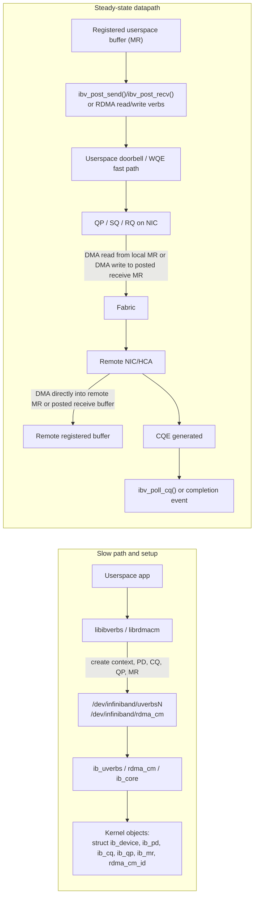

# Undergraduate Project Design for PCIe PF and VF, Linux Netdev, Devlink, and RDMA

## Executive Summary

A solid undergraduate project in this area should treat a modern NIC as **one physical adapter exposed through several Linux namespaces at once**: as a PCIe function (`struct pci_dev`), as one or more Linux network interfaces (`struct net_device`), as one or more devlink ports (`struct devlink_port`), and, when RDMA is enabled, as an RDMA device (`struct ib_device`) with userspace verbs and CM entry points. The intellectual core of the project is to prove, on one live system, which names in each namespace refer to the same underlying hardware resources and which names refer to derived control-plane objects such as representors. citeturn24view0turn21view1turn24view1turn21view0

The most important conceptual correction is that **RDMA is not a topology**. In Linux, the RDMA CM exposes a **transport-neutral** programming model, while the underlying link can be native InfiniBand or Ethernet-based RoCE; software RDMA can also be layered over an Ethernet netdev through RXE. Devlink makes this layering visible from a different angle by classifying ports as Ethernet or InfiniBand and by modeling PF, VF, and SF-related eswitch ports. citeturn18search1turn24view1turn21view8turn21view6

For datapath analysis, the project should compare three paths: ordinary sockets, AF_XDP, and RDMA verbs. Ordinary sockets normally incur a CPU copy on TX from userspace into kernel packet buffers and a CPU copy on RX from kernel packet buffers into userspace, with DMA between NIC and host memory on both directions. AF_XDP in zero-copy mode removes the kernel-to-userspace packet copy by letting the NIC DMA directly into or out of UMEM-backed frames, while copy mode deliberately reintroduces that copy. RDMA verbs go further: once memory is registered and the queue pair is established, the steady-state fast path is designed around direct NIC DMA to or from registered user memory, with kernel crossings concentrated in setup and resource management instead of in each transfer. citeturn30view0turn29view3turn35search0turn27view4turn38view0

The best project structure is therefore a **mapping-first, benchmarking-second** design. First, build a reproducible graph that maps BDFs, PFs, VFs, netdevs, devlink ports, representors, RDMA devices, uverbs devices, and sysfs/device nodes. Second, benchmark sockets, AF_XDP, and RDMA on the same host pair while measuring latency, bandwidth, CPU cycles, and copy behavior. That produces a rigorous report and a defensible set of experimental conclusions without requiring vendor-specific assumptions beyond “a modern SR-IOV-capable NIC with RDMA support.” citeturn24view0turn24view1turn21view3turn21view0turn43search0

## Background and Kernel Object Map

A useful mental model is to separate the system into four linked layers. The **PCIe/SR-IOV layer** names functions by BDF and models them as `struct pci_dev`. The **Linux networking layer** exposes interfaces as `struct net_device` under `/sys/class/net`. The **devlink layer** models switch-facing and function-facing ports, including physical ports and PF/VF/SF-related eswitch ports, through `struct devlink_port`. The **RDMA layer** registers `struct ib_device` instances with `ib_register_device()` and then exposes control and userspace access through sysfs and `/dev/infiniband/*`. citeturn24view0turn21view1turn24view1turn21view0turn38view0

That separation is exactly why one physical adapter may appear under several names. A single PF can own VFs via SR-IOV sysfs files, a PF or VF can have one or more netdevs, switchdev mode can add representor netdevs for virtual functions, and the same adapter can simultaneously register an RDMA device that `ibv_devinfo` lists for userspace. The project becomes rigorous when it proves those correspondences explicitly, rather than assuming them from naming conventions. citeturn25view0turn21view4turn21view5turn21view9

| Term | Layer | Kernel object | Sysfs path | Userspace tool | RX/TX relevance |
|---|---|---|---|---|---|
| SmartNIC | Device architecture | Usually multiple `struct pci_dev` instances plus devlink/eswitch objects; often multiple controllers in devlink view | `/sys/bus/pci/devices/<BDF>/...` | `lspci`, `devlink dev show`, `devlink port show` | A SmartNIC often exposes embedded switching and multi-controller relationships that make PF/VF/representor mapping more interesting than on a plain NIC. citeturn24view1turn32view0 |
| PCIe function | PCIe / driver core | `struct pci_dev` | `/sys/bus/pci/devices/<DOMAIN:BUS:DEV.FUNC>/` | `lspci -Dnn`, `readlink`, `devlink dev show` | This is the stable anchor for PF/VF identity, DMA capability, BAR mapping, and driver binding. citeturn41search1turn25view0 |
| Physical Function | SR-IOV | `struct pci_dev` for PF | `/sys/bus/pci/devices/<PF>/sriov_totalvfs`, `sriov_numvfs`, `virtfn*`, `sriov_drivers_autoprobe` | `cat`, `echo`, `lspci`, `devlink` | The PF creates and owns VFs and usually anchors devlink eswitch control. citeturn24view0turn25view0 |
| Virtual Function | SR-IOV | `struct pci_dev` for VF | `/sys/bus/pci/devices/<VF>/physfn` | `readlink`, `lspci` | The VF is hot-plug-like from the kernel’s perspective and may have its own driver, netdev, and sometimes RDMA capability, depending on hardware and policy. citeturn24view0turn25view0 |
| NIC / netdev | Linux networking | `struct net_device` | `/sys/class/net/<iface>/...` | `ip link`, `ethtool -i`, `cat /sys/class/net/...` | The netdev is the socket-stack datapath endpoint and the object that owns TX/RX queues exposed to the generic network stack. citeturn21view1turn26view0 |
| `/sys/class/net` device | Sysfs view of netdev | `struct net_device` plus class-device links | `/sys/class/net/<iface>/ifindex`, `iflink`, `phys_port_name`, `phys_switch_id`, `queues/...` | `cat`, `ls`, `readlink` | This is the fastest way to inspect queue topology and physical-switch/port metadata when correlating representors and uplinks. citeturn26view0turn42search6 |
| Devlink port | Devlink / eswitch | `struct devlink_port` | Netlink-first interface; correlate through `phys_port_name`, `phys_switch_id`, and devlink handles rather than a single stable per-port sysfs ABI | `devlink port show` | Devlink ports distinguish physical, PF, VF, SF, and virtual ports and expose switchdev-facing control-plane identity. citeturn24view1turn21view7 |
| Switchdev representor | Netdev + eswitch | `struct net_device` representing a representee; control-plane relation carried by devlink/eswitch | Usually observed under `/sys/class/net/<repr>/...`, especially `phys_port_name` and `phys_switch_id` | `ip link`, `devlink port show`, bridge/TC tools | Representors are both control-plane handles and data-plane endpoints for steering packets to and from VFs in switchdev mode. citeturn21view4turn21view5turn32view0 |
| RDMA device | RDMA core | `struct ib_device` | `/sys/class/infiniband/<ibdev>/...`, including `ports/<p>/gid_attrs/...` | `rdma link show`, `ibv_devinfo`, `ibv_devices` | This is the RDMA namespace anchor; it may correspond to native InfiniBand or Ethernet-backed RoCE/RXE. citeturn21view0turn21view6turn21view8turn21view9 |
| Userspace verbs / uverbs | RDMA userspace ABI | `ib_uverbs` objects, userspace contexts, and per-object kernel handles | `/sys/class/infiniband_verbs/uverbs*`; device nodes `/dev/infiniband/uverbs*` | `ibv_devinfo`, libibverbs apps | Slow-path setup crosses the kernel via uverbs; fast path is typically MMIO plus DMA with no syscall per message. citeturn38view0turn21view6 |
| RDMA CM | RDMA connection management | `struct rdma_cm_id` and CM resources | Device node `/dev/infiniband/rdma_cm` from rdma-core userspace stack | `rdma` tools, librdmacm apps | CM is transport-neutral; it explains why RDMA is a semantic layer over multiple underlying link technologies rather than a single topology. citeturn18search1turn40search1turn40search4 |
| `ibv_devinfo` | Userspace inspection | Enumerates devices backed by libibverbs / `struct ib_device` exposure | Indirectly reflects `/sys/class/infiniband` and uverbs state | `ibv_devinfo -l`, `ibv_devinfo -v` | Historically named after InfiniBand verbs, but functionally it lists RDMA devices available to userspace. citeturn21view9turn19search11turn38view0 |
| NAPI and queueing | Driver ↔ stack datapath | `struct napi_struct`, `struct netdev_queue`, driver RX/TX rings | `/sys/class/net/<iface>/queues/rx-*`, `queues/tx-*` | `ethtool -l`, `ls /sys/class/net/<iface>/queues` | NAPI defines the modern RX polling model; TX completion accounting also flows through generic queue interfaces. citeturn21view2turn26view0turn29view4 |
| Packet buffer | Networking datapath | `struct sk_buff` | Not a primary sysfs object | `perf`, tracepoints, driver docs | `sk_buff` is the central packet object for the ordinary socket path and for many non-zero-copy paths. citeturn28view0turn29view0turn30view0 |

The answer to “**where are RDMA devices?**” is therefore layered. In sysfs they live mainly under `/sys/class/infiniband`, `/sys/class/infiniband_verbs`, and `/sys/class/infiniband_mad`; in device files they live under `/dev/infiniband/uverbs*`, `/dev/infiniband/rdma_cm`, and `/dev/infiniband/umad*`; in iproute2 they show up through `rdma link show` and `rdma resource show`; and in verbs userspace they show up through `ibv_devices` and `ibv_devinfo`. citeturn21view6turn38view0turn40search1turn21view8turn33view0turn21view9

The answer to “**is RDMA a transport or is it on top of something?**” is also layered. Linux treats CM semantics as transport-neutral; devlink distinguishes Ethernet versus InfiniBand port types; RoCE GID entries in sysfs explicitly record whether a GID is `IB/RoCE v1` or `RoCE v2`; and RXE lets a software RDMA link attach directly to an Ethernet netdev. So, for project purposes, the clean statement is: **RDMA is a programming and transport-semantic layer, carried natively by InfiniBand or over Ethernet in RoCE/RXE deployments.** citeturn18search1turn24view1turn21view6turn21view8

## RX and TX Path Diagrams

The three diagrams below are intentionally drawn around **copy points** and **kernel object boundaries**, because that is what lets the project measure, rather than merely describe, the differences between sockets, AF_XDP, and RDMA. The exact low-level driver functions vary by NIC vendor, but the generic object transitions and API entry points below are stable enough to build a rigorous lab around. citeturn30view0turn21view2turn35search0turn38view0

### Normal sockets

```mermaid
flowchart LR
  subgraph TX["TX path"]
    A["Userspace buffer"] -->|send()/sendmsg() CPU copy begins| B["__sys_sendto()/__sys_sendmsg()"]
    B --> C["sock_sendmsg(struct socket)"]
    C --> D["Protocol send path<br/>inet_sendmsg() -> tcp_sendmsg()/udp_sendmsg()"]
    D --> E["Build/fill struct sk_buff<br/>struct sock + struct sk_buff"]
    E --> F["ip_queue_xmit()/ip_local_out()"]
    F --> G["__dev_queue_xmit()"]
    G --> H["Driver ndo_start_xmit()<br/>struct net_device"]
    H --> I["dma_map_*() + TX ring descriptor"]
    I --> J["NIC DMA reads packet data"]
    J --> K["Wire"]
  end

  subgraph RX["RX path"]
    L["Wire"] --> M["NIC DMA writes into RX buffer/page"]
    M --> N["IRQ / MSI-X"]
    N --> O["napi_schedule()"]
    O --> P["Driver poll(napi,budget)"]
    P --> Q["napi_build_skb()/build_skb()<br/>or page_pool-backed buffer"]
    Q --> R["napi_gro_receive() / netif_receive_skb()"]
    R --> S["ip_rcv() -> tcp_v4_rcv()/udp_rcv()"]
    S --> T["Socket receive queue"]
    T -->|recv()/recvmsg() CPU copy to userspace| U["Userspace buffer"]
  end
```

In the ordinary socket path, the important CPU-copy points are typically **userspace to kernel packet memory on TX** and **kernel packet memory to userspace on RX**. The generic networking core then sends and receives `struct sk_buff` objects through `__dev_queue_xmit()` and `netif_receive_skb()`, while NAPI schedules RX polling and drivers use `ndo_start_xmit()` for TX submission. DMA is still present on both directions, but DMA is not a CPU copy; it is NIC access to host memory. Many modern drivers further optimize RX buffers through page-pool recycling and `napi_build_skb()`. citeturn14search0turn30view0turn21view2turn29view0turn29view3turn28view0turn31search6

For the report and for the lab, the related kernel objects worth naming explicitly are `struct socket`, `struct sock`, `struct sk_buff`, `struct net_device`, `struct napi_struct`, and the driver’s private RX/TX ring-descriptor structures. The exact protocol functions depend on TCP versus UDP, but the stable project-level statement is that ordinary sockets move through the full network stack, qdisc/dev queueing, and driver `ndo_start_xmit()`/NAPI paths. citeturn14search0turn21view1turn21view2turn30view0

### AF_XDP

```mermaid
flowchart LR
  subgraph RX["RX path"]
    A["Userspace UMEM frames"] --> B["FILL ring"]
    B --> C["NIC DMA writes packet into UMEM-backed memory"]
    C --> D["XDP program on bound queue"]
    D -->|bpf_redirect_map(XSKMAP)| E["__xsk_map_redirect()"]
    E --> F["xsk_rcv()"]
    F -->|zero-copy path| G["xsk_rcv_zc()<br/>descriptor move, no payload copy"]
    F -->|copy mode| H["__xsk_rcv()<br/>CPU copies packet data"]
    G --> I["RX ring: struct xdp_desc"]
    H --> I
    I --> J["Userspace app consumes descriptors"]
  end

  subgraph TX["TX path"]
    J --> K["Userspace writes payload into UMEM frame"]
    K --> L["TX ring"]
    L --> M["Driver/XSK core peeks descriptors<br/>xsk_tx_peek_desc()"]
    M --> N["NIC DMA reads UMEM payload"]
    N --> O["Wire"]
    O --> P["TX completion"]
    P --> Q["xsk_tx_completed() -> COMPLETION ring"]
    Q --> J
  end
```

AF_XDP binds an XSK to **one netdev and one queue id**, associates it with a UMEM region, and uses RX/TX plus FILL/COMPLETION rings to transfer frame ownership. The decisive experimental control is the bind mode: the kernel first tries zero-copy, falls back to copy mode if needed, and can be forced into one mode or the other with `XDP_ZEROCOPY` or `XDP_COPY`. In the ingress path, traffic reaches the socket through XDP redirect using `XSKMAP` and `bpf_redirect_map()`. citeturn35search0turn27view0turn27view1turn27view2turn27view4

The key AF_XDP kernel objects are `struct xdp_sock`, `struct xsk_buff_pool`, `struct xdp_desc`, and UMEM state. In the kernel source, representative functions on the RX side are `__xsk_map_redirect()`, `xsk_rcv()`, and the zero-copy branch `xsk_rcv_zc()`. On the TX side, descriptor harvesting and completion accounting run through functions such as `xsk_tx_peek_desc()` and `xsk_tx_completed()`. This gives the project a very clean copy taxonomy: **zero-copy AF_XDP has no kernel/userspace payload copy, while copy-mode AF_XDP does.** citeturn8view2turn9view4turn9view3

### RDMA verbs



RDMA is where the project can most clearly separate **slow-path control** from **fast-path data movement**. Kernel documentation states that uverbs character devices handle slow-path resource management, while fast-path operations are typically performed by writing directly to hardware registers mapped into userspace, without a system call or context switch for each transfer. The same documentation also explains that the kernel pins MR pages and tracks userspace resources through uverbs context tables. citeturn38view0

The setup objects that the project should name explicitly are `struct ib_device`, `struct ib_pd`, `struct ib_cq`, `struct ib_qp`, `struct ib_mr`, and, when using CM, `struct rdma_cm_id`. Driver registration into the RDMA core occurs through `ib_register_device()`. On the userspace side, the core verbs that matter for the copy map are `ibv_reg_mr()`, `ibv_post_send()`, `ibv_post_recv()`, and `ibv_poll_cq()`. citeturn21view0turn19search0turn18search2turn18search4turn19search1

For a copy analysis, the strongest statement is this: **after setup, the RDMA steady-state datapath is intentionally built so that the NIC DMA engine accesses registered userspace memory directly**. That is why RDMA Write is especially interesting pedagogically: the receiver can have data appear in a registered buffer without a socket-stack receive copy. The project should still teach the caveat that memory registration itself is not free, because the kernel pins pages and enforces locking and accounting constraints. citeturn38view0turn19search0turn18search2turn18search4

## Commands to Correlate Layers on a Live System

The shortest path to a trustworthy live-system map is to walk **PCI BDF → PF/VF sysfs → netdev sysfs → devlink → RDMA sysfs and uverbs**. The commands below are intentionally “stitching commands”: each one reveals one edge in that graph. citeturn25view0turn26view0turn32view0turn21view7turn21view8turn33view0turn21view9

```bash
# Discover candidate NIC / RDMA PCI devices
lspci -Dnn | egrep -i 'ethernet|network|infiniband'

# Pick a PF BDF
PF=0000:03:00.0

# PF -> VF relationships
cat /sys/bus/pci/devices/$PF/sriov_totalvfs
cat /sys/bus/pci/devices/$PF/sriov_numvfs
ls -l /sys/bus/pci/devices/$PF/virtfn*
cat /sys/bus/pci/devices/$PF/sriov_drivers_autoprobe

# Example VF -> PF reverse mapping
VF=0000:03:00.2
readlink -f /sys/bus/pci/devices/$VF/physfn
```

Those files are the kernel’s canonical SR-IOV control and discovery surface: `sriov_totalvfs`, `sriov_numvfs`, `virtfn*`, `physfn`, and `sriov_drivers_autoprobe`. citeturn24view0turn25view0

```bash
# Netdev -> underlying device
IF=enp3s0f0
readlink -f /sys/class/net/$IF/device
ethtool -i $IF

# Netdev metadata useful for representor / switch correlation
cat /sys/class/net/$IF/ifindex
cat /sys/class/net/$IF/iflink
cat /sys/class/net/$IF/phys_port_name
cat /sys/class/net/$IF/phys_switch_id
ls /sys/class/net/$IF/queues
```

On PCI NICs, resolving `/sys/class/net/<iface>/device` is the quickest operational bridge from a netdev name to the physical device tree, while `phys_port_name` and `phys_switch_id` are the most useful class-net attributes for identifying representors and switch relationships. citeturn26view0turn42search6

```bash
# Devlink device and port views
devlink dev show
devlink dev eswitch show pci/$PF
devlink port show

# Optional: enable switchdev mode if supported
devlink dev eswitch set pci/$PF mode switchdev
devlink port show
```

`devlink dev show` gives the devlink device handle, `devlink dev eswitch show` reveals whether the adapter is in legacy or switchdev mode, and `devlink port show` exposes port flavour and type information that ties physical ports, PFs, VFs, and sometimes SFs together. citeturn32view0turn21view7turn24view1

```bash
# RDMA device locations and views
ls /sys/class/infiniband
ls /sys/class/infiniband_verbs
ls /sys/class/infiniband_mad
ls /dev/infiniband

ibv_devices
ibv_devinfo -l
ibv_devinfo -v

rdma link show
rdma resource show
```

This block answers the user’s “where are RDMA devices?” question directly: sysfs classes, `/dev/infiniband` character devices, verbs enumeration, and iproute2 RDMA views all expose the same subsystem from different angles. citeturn21view6turn38view0turn40search1turn21view8turn33view0turn21view9turn19search11

```bash
# RDMA device -> PCI device and RoCE netdev correlation
for d in /sys/class/infiniband/*; do
  echo "ibdev=$(basename "$d")"
  readlink -f "$d/device"
done

# For RoCE-capable devices, map GID entries to netdev names and GID types
grep -H . /sys/class/infiniband/*/ports/*/gid_attrs/ndevs/* 2>/dev/null || true
grep -H . /sys/class/infiniband/*/ports/*/gid_attrs/types/* 2>/dev/null || true
```

For RoCE, the GID sysfs ABI is the cleanest built-in bridge from RDMA port state to Linux netdev identity, because `gid_attrs/ndevs/*` exposes the associated net-device name and `gid_attrs/types/*` exposes whether the entry is InfiniBand/RoCE v1 or RoCE v2. citeturn21view6

An **illustrative** output shape on a representative system looks like this:

```text
$ ibv_devinfo -l
mlx5_0

$ rdma link show
link mlx5_0/1 state ACTIVE physical_state LINK_UP netdev enp3s0f0

$ devlink port show
pci/0000:03:00.0/1: type eth flavour physical netdev enp3s0f0
pci/0000:03:00.0/32768: type eth flavour pcivf pfnum 0 vfnum 0 netdev pf0vf0
```

The exact names and indices vary by vendor and driver, but the shape is stable: a PCI-anchored devlink handle, a netdev name, and an RDMA device name all become visible in one joined graph. citeturn21view7turn21view8turn21view9

## Step-by-Step Lab Project Plan

### Objectives

The project should have three explicit objectives. First, build a **kernel object map** that proves how one adapter appears as PCIe PF/VF functions, netdevs, devlink ports, and RDMA devices. Second, trace the **RX/TX copy path** for ordinary sockets, AF_XDP, and RDMA, distinguishing CPU copies from DMA transfers. Third, measure **latency, bandwidth, and CPU cost** so that the architecture is not merely described but experimentally validated. citeturn24view0turn24view1turn35search0turn38view0

### Required hardware and software

The strongest configuration is **two Linux hosts** connected back-to-back or through a simple switch, each with a modern SR-IOV-capable NIC. If physical RDMA networking is unavailable, the project remains viable by using **RXE** (`rdma link add ... type rxe netdev <if>`) as a software fallback for RDMA concepts and by treating PF/VF creation plus switchdev as optional extensions depending on hardware support. Root privileges are effectively required for SR-IOV enablement, many devlink operations, and XDP installation. citeturn21view8turn24view0turn32view0

A practical software baseline is a recent Linux 6.x kernel, iproute2 with `devlink` and `rdma`, `ethtool`, `perf`, `taskset`, rdma-core/libibverbs, and an AF_XDP-capable toolchain such as libbpf plus a small sample program. For RDMA benchmarks, the `linux-rdma/perftest` suite is a sensible optional dependency because it already provides send/read/write bandwidth and latency microbenchmarks over uverbs. citeturn34search0turn34search1turn21view8turn21view7turn43search0

### Experiments

The first experiment should be a **device mapping experiment**. Start with one PF BDF, record `sriov_totalvfs` and `sriov_numvfs`, create a small number of VFs if supported, and then map PF/VF BDFs to netdevs, devlink ports, and RDMA devices using the stitching commands above. The deliverable is a graph or CSV file with columns such as `BDF, role, netdev, devlink_port, rdma_dev, uverbs_dev, notes`. citeturn24view0turn25view0turn21view7turn21view8turn21view9

The second experiment should be a **mode comparison experiment** for PF/VF and switchdev. Record the system state in legacy mode, then, if supported, switch the device to switchdev and record the new state. The point is not merely to “turn switchdev on” but to document exactly which new representor netdevs and devlink port flavours appear, and how that changes the control-plane graph seen by Linux. citeturn32view0turn21view4turn21view5turn24view1

The third experiment should be a **datapath benchmark matrix**. Compare ordinary sockets, AF_XDP copy mode, AF_XDP zero-copy mode, RDMA Send/Recv, and RDMA Write. Collect throughput, RTT or one-way latency where possible, CPU cycles, instructions, context switches, and driver statistics. Pin both server and client workloads to fixed CPUs so that scheduler noise does not dominate the results. citeturn27view4turn38view0turn34search0turn34search1turn43search0

The fourth experiment should be a **zero-copy validation experiment**. For AF_XDP, force `XDP_ZEROCOPY` and `XDP_COPY` in separate runs and compare CPU cost at the same offered load; the zero-copy bind should either succeed or fail closed. For RDMA, compare socket send/receive with RDMA Send and RDMA Write while using registered memory. The project should interpret a clear drop in cycles per byte and context switches, together with the architectural copy map, as evidence that the datapath has moved from copy-heavy to DMA-dominated operation. citeturn27view4turn38view0turn19search0turn18search2turn43search0

### Measurement scripts and commands

A compact collection harness is enough for an undergraduate lab:

```bash
#!/usr/bin/env bash
# collect_metrics.sh
# usage:
#   CPUSET=2 NETDEV=enp3s0f0 CMD='ib_write_bw -d mlx5_0 --report_gbits 10.0.0.2' ./collect_metrics.sh rdma-write
set -euo pipefail

MODE=${1:?mode-name}
: "${NETDEV:?set NETDEV}"
: "${CMD:?set CMD}"

OUT="results/${MODE}"
mkdir -p "$OUT"

ethtool -S "$NETDEV" > "$OUT/ethtool.before.txt" || true
rdma link show > "$OUT/rdma.link.before.txt" || true
rdma resource show > "$OUT/rdma.resource.before.txt" || true

taskset -c "${CPUSET:-2}" \
perf stat -x, -o "$OUT/perf.csv" \
  -e cycles,instructions,cache-misses,context-switches,cpu-migrations,page-faults \
  bash -lc "$CMD" > "$OUT/stdout.txt" 2> "$OUT/stderr.txt"

ethtool -S "$NETDEV" > "$OUT/ethtool.after.txt" || true
rdma link show > "$OUT/rdma.link.after.txt" || true
rdma resource show > "$OUT/rdma.resource.after.txt" || true
```

That harness is enough because `perf stat` provides CPU-counter measurements, `taskset` stabilizes CPU placement, `ethtool -S` captures driver-side queue and drop counters, and `rdma resource show` records QP/CQ/MR state for RDMA runs. citeturn34search0turn34search1turn33view0turn21view8

For a minimal sockets baseline without extra packages, a small Python program is sufficient:

```python
# tcp_bw.py
# server: python3 tcp_bw.py server 5001
# client: python3 tcp_bw.py client <server-ip> 5001 4G
import socket, sys, time

def parse_size(s: str) -> int:
    mult = {"K": 1024, "M": 1024**2, "G": 1024**3}
    return int(s[:-1]) * mult[s[-1].upper()] if s[-1].isalpha() else int(s)

mode = sys.argv[1]

if mode == "server":
    port = int(sys.argv[2])
    srv = socket.socket()
    srv.setsockopt(socket.SOL_SOCKET, socket.SO_REUSEADDR, 1)
    srv.bind(("0.0.0.0", port))
    srv.listen(1)
    conn, _ = srv.accept()
    total = 0
    t0 = time.time()
    while True:
        data = conn.recv(1 << 20)
        if not data:
            break
        total += len(data)
    dt = time.time() - t0
    print(f"received_bytes={total} seconds={dt:.6f} gbps={(total*8/dt)/1e9:.3f}")
else:
    host, port, total_s = sys.argv[2], int(sys.argv[3]), sys.argv[4]
    total = parse_size(total_s)
    buf = b"x" * (1 << 20)
    cli = socket.socket()
    cli.connect((host, port))
    sent = 0
    t0 = time.time()
    while sent < total:
        n = cli.send(buf[: min(len(buf), total - sent)])
        sent += n
    cli.shutdown(socket.SHUT_WR)
    dt = time.time() - t0
    print(f"sent_bytes={sent} seconds={dt:.6f} gbps={(sent*8/dt)/1e9:.3f}")
```

Representative launch commands can then be written as:

```bash
# sockets
NETDEV=enp3s0f0 CMD='python3 tcp_bw.py client 10.0.0.2 5001 4G' ./collect_metrics.sh sockets

# AF_XDP copy mode
NETDEV=enp3s0f0 CMD='./your_xsk_app --dev enp3s0f0 --queue 2 --mode copy' ./collect_metrics.sh afxdp-copy

# AF_XDP zero-copy
NETDEV=enp3s0f0 CMD='./your_xsk_app --dev enp3s0f0 --queue 2 --mode zerocopy' ./collect_metrics.sh afxdp-zc

# RDMA send
NETDEV=enp3s0f0 CMD='ib_send_bw -d mlx5_0 --report_gbits 10.0.0.2' ./collect_metrics.sh rdma-send

# RDMA write
NETDEV=enp3s0f0 CMD='ib_write_bw -d mlx5_0 --report_gbits 10.0.0.2' ./collect_metrics.sh rdma-write
```

The RDMA command names above come from the standard perftest suite, which includes send, read, and write latency/bandwidth microbenchmarks on top of uverbs. citeturn43search0

### Expected results

The expected ranking for **CPU overhead per Gbit/s** is usually: ordinary sockets highest, AF_XDP zero-copy lower, and RDMA Send/Write lowest. That expectation follows directly from the copy map: ordinary sockets traverse the full skb-based stack and normally copy across the user/kernel boundary; AF_XDP zero-copy removes that boundary copy for packet payloads; RDMA pushes data directly between NIC DMA engines and registered user buffers. Actual absolute numbers will still depend on MTU, queue count, interrupt moderation, and hardware offloads. citeturn30view0turn35search0turn38view0

For **latency**, the gain from AF_XDP is usually most visible at small packet sizes and high packet rates, where the ordinary stack’s generic skb and protocol processing costs dominate. RDMA Write often minimizes receiver CPU work because the target buffer is a registered MR rather than a socket receive buffer. For **bandwidth**, large-message results may compress the gap between paths once DMA and line rate dominate, but the cycles-per-byte gap should remain informative. citeturn27view4turn38view0turn43search0

### Risk and mitigation

The first risk is that the chosen NIC may support SR-IOV but **not** AF_XDP zero-copy, switchdev, or RDMA on VFs. The mitigation is to design the report around **feature detection**, not feature assumption: test `XDP_ZEROCOPY`, inspect `devlink dev eswitch show`, and document which features were present rather than forcing a uniform path across all adapters. citeturn27view4turn32view0

The second risk is the absence of a physical RDMA fabric or RoCE configuration. The mitigation is to use **RXE** as a software fall-back so that the RDMA namespace, uverbs objects, CM flows, and MR/QP/CQ logic can still be studied, even if the absolute performance results no longer represent hardware RoCE. citeturn21view8turn18search1

The third risk is that switchdev/representor experiments require vendor-specific support. The mitigation is to separate the project into a **mandatory core** and an **optional advanced track**: the mandatory core covers PCIe PF/VF, netdev, RDMA, sysfs, and copy-path analysis; the advanced track adds switchdev representors and port-function attributes if the adapter supports them. citeturn24view1turn21view5

The fourth risk is methodological rather than technical: without CPU pinning and queue steering, the measured differences can collapse into scheduler noise. The mitigation is simple and important: pin processes with `taskset`, keep queue IDs fixed, record `ethtool -l` / `/sys/class/net/<iface>/queues`, and repeat each run enough times to report median and variance, not a single “best” result. citeturn34search1turn26view0

## Prioritized Sources

The following source stack is the best one to cite in the final project report, in roughly descending order of importance.

**Linux kernel primary documentation**
  
The Linux kernel’s **PCI SR-IOV Howto** is the canonical reference for PF/VF semantics, `sriov_numvfs`, `pci_enable_sriov()`, and the PF/VF hotplug model. citeturn24view0

The **Devlink Port** documentation is the canonical reference for devlink port flavours, port types, controller concepts, and SmartNIC-style multi-controller views. citeturn24view1

The **Network Devices** and **NAPI** docs are the canonical references for `struct net_device`, registration APIs, and the modern RX poll model. citeturn21view1turn21view2

The **AF_XDP** documentation is the canonical reference for UMEM, rings, XSKMAP, zero-copy versus copy mode, and queue binding rules. citeturn35search0turn27view2turn27view4

The **InfiniBand and RDMA Interfaces** documentation plus **Userspace verbs access** are the canonical references for `struct ib_device`, `ib_register_device()`, uverbs slow-path versus fast-path behavior, and memory pinning. citeturn21view0turn38view0

The **sysfs ABI** documents for class-net, bus-pci, and class-infiniband are the canonical references for the files this project will read and correlate. citeturn26view0turn25view0turn21view6

**Official userspace and tooling references**

The iproute2 man pages for **devlink-dev**, **devlink-port**, **rdma-link**, and **rdma-resource** are the best operational references for live-system discovery commands. citeturn32view0turn21view7turn21view8turn33view0

The RDMA userspace references for **`ibv_devinfo`**, **`ibv_reg_mr`**, **`ibv_post_send`**, **`ibv_post_recv`**, and **`ibv_poll_cq`** are the best references for the verbs object model and completion semantics. citeturn21view9turn19search0turn18search2turn18search4turn19search1

The official **rdma-core** repository is the best umbrella source for the Linux RDMA userspace stack and the mapping from libraries to `/dev/infiniband/uverbsX`, `/dev/infiniband/rdma_cm`, and `/dev/infiniband/umadX`. citeturn40search1

**Benchmarking and vendor-specific deep dives**

The official `linux-rdma/perftest` suite is the most practical benchmark reference for `ib_send_bw`, `ib_send_lat`, `ib_read_bw`, `ib_read_lat`, `ib_write_bw`, and `ib_write_lat`. citeturn43search0

For mlx5- or ConnectX-oriented extensions, the most useful vendor-specific material is from entity["company","NVIDIA","chipmaker"]: the mlx5 **switchdev** documentation for eswitch and port-function behavior, and the **RDMA Aware Networks Programming** material for QP/CQ/MR/PD concepts and verbs examples. These are excellent secondary sources after the kernel docs, not before them. citeturn21view5turn18search5turn18search15turn18search14

In one sentence, the project should conclude with this mapping rule: **BDF anchors the hardware, netdev anchors the socket path, devlink anchors the eswitch/control-plane view, and `ib_device`/uverbs anchor the RDMA view; the engineering question is not which one is “the real device,” but exactly how Linux links them together and where copies disappear as you move from sockets to AF_XDP to RDMA.** citeturn24view0turn21view1turn24view1turn21view0turn35search0turn38view0