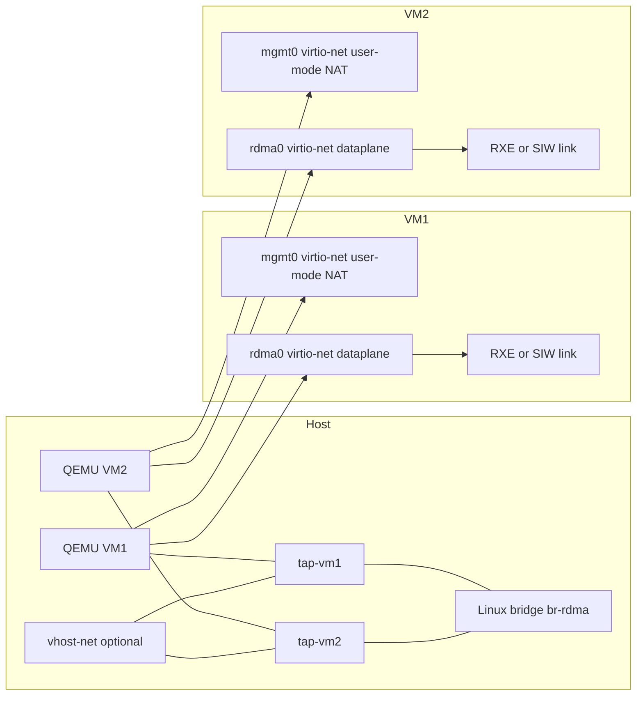
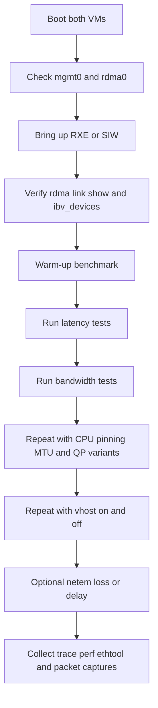
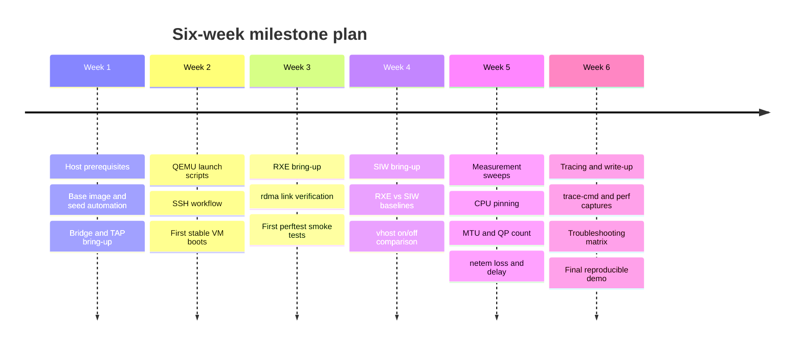

# Practical Guide to a Two-VM virtio-net Software RDMA Lab

## Executive summary

The most practical way to learn modern Linux software RDMA in a virtual lab is to build **two QEMU/KVM VMs**, give each VM a **dedicated virtio-net dataplane NIC** attached to a **host TAP+bridge network**, and then create either an **RXE** or **SIW** RDMA link on that NIC from inside the guest with `rdma link add`. Upstream `rdma-core` explicitly documents this workflow for both `rdma_rxe` and `siw`, and the `rdma-link` man page defines `rxe` and `siw` as the two software link types. citeturn32view0turn34view0

For reproducibility in April 2026, I would standardize on a **current longterm kernel line** such as **6.6**, **6.12**, or **6.18**, use **QEMU/KVM with TAP**, and keep **`vhost-net` enabled for performance runs** but **disabled for some tracing sessions** when you want a simpler userspace-visible datapath. Kernel.org currently lists 6.18, 6.12, and 6.6 as maintained longterm branches, Ubuntu’s QEMU documentation recommends KVM-backed QEMU on Ubuntu and shows QEMU 8.2.1+ for 24.04, QEMU’s networking docs define TAP/bridge backends, and the classic vhost-net description is that it reduces the number of system calls in virtio networking. citeturn24search0turn25view0turn8view2turn10view0turn41search1

The right learning order is **RXE first, SIW second**. RXE is conceptually closer to a RoCE-style Ethernet RDMA path and is easy to observe on the wire because RoCEv2 uses UDP destination port 4791; SIW is software iWARP layered over TCP and is often the more forgiving transport when you intentionally introduce packet loss or jitter in the lab. This distinction follows the `rdma-link` definitions, the iWARP RFC suite, and the IANA RoCE registration. citeturn34view0turn14search0turn14search1turn14search15turn29search1

The lab is best used to understand **verbs semantics, RDMA CM flow, virtio/vhost effects, MTU and queueing, packet-loss sensitivity, and tracing methodology**. It is **not** a good proxy for absolute hardware-RNIC performance, because software RDMA providers and virtio networking push much more transport work into CPU software than hardware RDMA does. That conclusion is consistent with the virtio design paper, the software-RDMA literature, and the vhost-net design rationale. citeturn15search1turn15search0turn16search0turn41search1

## Lab architecture and design choices

A clean architecture separates **management traffic** from **RDMA test traffic**. Give each VM two virtio NICs: one management NIC on QEMU user-mode networking for SSH/bootstrap convenience, and one dedicated RDMA NIC on an isolated host bridge for measurements. QEMU documents both the user-mode backend and TAP/bridge backends, and QEMU’s TAP documentation explicitly requires `/dev/net/tun`. citeturn8view2turn8view3turn10view0

The dataplane below is the one to benchmark. It keeps the RDMA path on a dedicated virtio-net interface and allows you to compare `vhost=on` against `vhost=off` later without changing guest configuration. QEMU documents TAP+bridge usage, and QEMU’s virtio RSS documentation explicitly discusses `tap,vhost=on` and `tap,vhost=off` combinations for virtio-net. citeturn10view0turn13view1



The key protocol choice is whether your software RDMA provider should emulate **RoCE-like** behavior or **iWARP-like** behavior. The `rdma-link` interface exposes both as first-class software link types; iWARP semantics are specified by RFC 5040/5041/5044; RoCEv2 is conventionally identified by UDP destination port 4791. The following comparison is the one that matters for this project. citeturn34view0turn14search0turn14search1turn14search15turn29search1turn16search0turn15search0

| Option | Transport shape | What you observe on the wire | Practical strength | Practical weakness | Best use in this lab |
|---|---|---|---|---|---|
| RXE | Software Soft-RoCE over Ethernet | UDP/4791 traffic for RoCEv2-style runs | Most natural Linux RoCE-style software lab; easy host-side packet capture | Sensitive to normal Ethernet loss/jitter patterns; high CPU cost | Start here for bring-up, tracing, and virtio/vhost experiments |
| SIW | Software iWARP over TCP | TCP traffic on the dataplane NIC | More forgiving on ordinary lossy lab setups because transport reliability is inherited from TCP | Additional TCP stack behavior can complicate interpretations; still high CPU | Run second for comparison and loss/jitter experiments |
| Hardware RDMA | NIC-offloaded RDMA | Often not visible at ordinary kernel capture points in the same way | Much better latency, bandwidth, and CPU efficiency | Needs real RNICs; different observability toolchain | Out-of-scope baseline, not the core lab |

The table above summarizes upstream functionality and transport properties from `rdma-link`, the iWARP RFCs, the RoCE port registry, and the software-RDMA literature. citeturn34view0turn14search0turn14search1turn14search15turn29search1turn16search0turn15search0

## Prerequisites and tested bill of materials

A practical baseline is shown below. The recommendations are intentionally conservative: they favor current upstream maintenance status, stable distro packaging, and simple automation over novelty. Kernel.org provides current longterm branches, Ubuntu documents QEMU/KVM usage and its QEMU baseline for 24.04, official Ubuntu cloud images are available, `cloud-localds` is the standard local NoCloud helper, `rdma-core` documents software RDMA setup, and Ubuntu’s perftest man pages document the benchmark tools. citeturn24search0turn25view0turn17search8turn30search0turn33view0turn32view0turn19view0

| Component | Recommendation | Why |
|---|---|---|
| Host OS | Recent Linux distribution; Ubuntu 24.04 LTS is a convenient baseline | Easy access to QEMU/KVM, cloud image tooling, and RDMA userspace |
| Host kernel | Longterm 6.6, 6.12, or 6.18 | Current maintained upstream lines |
| Guest OS | Ubuntu 24.04 cloud image | Easy first-boot automation with cloud-init |
| QEMU | 8.2+ class build | Mature virtio-net and bridge/TAP support |
| KVM | Required | You want virtualization, not slow emulation |
| Libvirt | Optional | Helpful if you want persistent XML-managed VMs |
| RDMA userspace | `rdma-core` | Required for `rdma`, `libibverbs`, and `librdmacm` |
| Benchmarks | `perftest` | Standard latency/bandwidth verbs microbenchmarks |
| Network inspection | `iproute2`, `ethtool`, `tcpdump` | Link state, MTU, channels, stats, packet capture |
| Tracing | `trace-cmd`, `perf` | Kernel event tracing and profiling |

The main kernel pieces are equally straightforward. On the **host**, you need KVM, TAP, bridge support, and optionally `vhost_net`; on the **guest**, you need `virtio_net` plus **either** `rdma_rxe` **or** `siw`. `rdma-core` also notes that you need an `iproute2` version recent enough for `rdma link add` to work. citeturn25view0turn8view2turn13view1turn32view0turn34view0

| Side | Required modules or devices | Notes |
|---|---|---|
| Host | `kvm`, `kvm_intel` or `kvm_amd`, `/dev/net/tun`, bridge support | Needed for accelerated VMs and TAP+bridge networking |
| Host optional | `vhost_net`, `/dev/vhost-net` | Use for performance-oriented virtio datapath runs |
| Guest | `virtio_net` | The virtio NIC driver |
| Guest | `rdma_rxe` or `siw` | Choose one software RDMA provider per run |
| Guest indirect deps | `ib_uverbs`, `rdma_cm`, `rdma_ucm` usually autoload through providers/userspace | Distro-dependent, typically automatic |

If you want a direct Ubuntu host package set, this is a reasonable starting point on the host:

```bash
sudo apt update
sudo apt install -y \
  cpu-checker qemu-system qemu-utils iproute2 bridge-utils \
  cloud-image-utils ethtool tcpdump trace-cmd rdma-core perftest \
  linux-tools-generic
kvm-ok
```

Ubuntu documents `kvm-ok`, notes that it comes from `cpu-checker`, and states that successful output should say KVM acceleration can be used; Ubuntu and QEMU both document `qemu-system` as the basic full-system package for Debian/Ubuntu-family systems. citeturn25view0turn17search17

## Environment build and automation

### Host-side network setup

QEMU documents pre-created TAP devices, bridge helpers, and bridge backends. For a lab, pre-creating TAPs yourself is simpler than relying on helper scripts because it makes all networking state explicit and reproducible. Use one isolated bridge, attach two TAPs, and optionally set all bridge/TAP/guest RDMA NIC MTUs to 9000 for jumbo-frame experiments. QEMU documents TAP and bridge backends, and `ip link` documents MTU changes. citeturn10view0turn8view2turn39view0turn39view2

```bash
#!/usr/bin/env bash
# host-net-up.sh
set -euo pipefail

BR=br-rdma
TAPS=(tap-vm1 tap-vm2)

sudo modprobe tun
sudo modprobe bridge
sudo modprobe vhost_net || true

sudo ip link add "${BR}" type bridge 2>/dev/null || true
sudo ip link set "${BR}" up

for t in "${TAPS[@]}"; do
  sudo ip tuntap add dev "${t}" mode tap 2>/dev/null || true
  sudo ip link set "${t}" master "${BR}"
  sudo ip link set "${t}" up promisc on
done

# Optional jumbo-frame experiment
# sudo ip link set dev "${BR}" mtu 9000
# for t in "${TAPS[@]}"; do sudo ip link set dev "${t}" mtu 9000; done

ip -br link show "${BR}" "${TAPS[@]}"
```

### Guest images and NoCloud seed disks

Ubuntu provides official cloud images, and cloud-init documents both the NoCloud datasource and the `cloud-localds` command for launching local cloud images with QEMU. The most robust trick is to **match the guest NICs by MAC address** in network-config so that your management NIC and RDMA NIC get stable names every boot. citeturn17search0turn17search8turn26search0turn33view0

Use a base image plus two overlays:

```bash
BASE=noble-server-cloudimg-amd64.img
qemu-img create -f qcow2 -F qcow2 -b "${BASE}" vm1.qcow2 20G
qemu-img create -f qcow2 -F qcow2 -b "${BASE}" vm2.qcow2 20G
```

Generate two NoCloud seed disks; the example below installs the required guest-side tooling and assigns static IPs on the dedicated RDMA NIC.

```bash
#!/usr/bin/env bash
# mk-seeds.sh
set -euo pipefail

make_seed () {
  local vm="$1" ip="$2" mgmt_mac="$3" rdma_mac="$4"

  cat > "user-data-${vm}.yaml" <<EOF
#cloud-config
package_update: true
packages:
  - rdma-core
  - perftest
  - ethtool
  - iproute2
  - tcpdump
  - trace-cmd
  - linux-tools-generic
users:
  - name: ubuntu
    sudo: ALL=(ALL) NOPASSWD:ALL
    groups: [adm, sudo]
    shell: /bin/bash
    lock_passwd: true
ssh_pwauth: false
EOF

  cat > "meta-data-${vm}.yaml" <<EOF
instance-id: ${vm}
local-hostname: ${vm}
EOF

  cat > "network-config-${vm}.yaml" <<EOF
version: 2
ethernets:
  mgmt0:
    match:
      macaddress: "${mgmt_mac}"
    set-name: mgmt0
    dhcp4: true
  rdma0:
    match:
      macaddress: "${rdma_mac}"
    set-name: rdma0
    dhcp4: false
    addresses:
      - ${ip}/24
    mtu: 9000
EOF

  cloud-localds --network-config="network-config-${vm}.yaml" \
    "seed-${vm}.img" "user-data-${vm}.yaml" "meta-data-${vm}.yaml"
}

make_seed vm1 192.168.100.11 52:54:00:12:00:11 52:54:00:34:00:11
make_seed vm2 192.168.100.12 52:54:00:12:00:12 52:54:00:34:00:12
```

### VM launch with virtio-net and optional vhost-net

The launch pattern uses one convenient management NIC and one dedicated benchmark NIC. QEMU documents user-mode networking, TAP networking, bridge networking, and the fact that bridge/TAP helpers exist if you prefer them; in this project, the explicit pre-created TAP path is the cleanest. citeturn8view2turn10view0

```bash
#!/usr/bin/env bash
# run-lab.sh
set -euo pipefail

launch_vm () {
  local vm="$1" disk="$2" seed="$3" sshfwd="$4" mgmt_mac="$5" rdma_mac="$6" tap="$7"

  qemu-system-x86_64 \
    -name "${vm}" \
    -machine q35,accel=kvm \
    -enable-kvm \
    -cpu host \
    -smp 4 \
    -m 4096 \
    -nographic \
    -daemonize \
    -drive if=virtio,format=qcow2,file="${disk}" \
    -drive if=virtio,format=raw,file="${seed}" \
    -nic user,model=virtio-net-pci,hostfwd=tcp::${sshfwd}-:22,mac="${mgmt_mac}" \
    -netdev tap,id=rdma0,ifname="${tap}",script=no,downscript=no,vhost=on \
    -device virtio-net-pci,netdev=rdma0,mac="${rdma_mac}"
}

launch_vm vm1 vm1.qcow2 seed-vm1.img 2221 52:54:00:12:00:11 52:54:00:34:00:11 tap-vm1
launch_vm vm2 vm2.qcow2 seed-vm2.img 2222 52:54:00:12:00:12 52:54:00:34:00:12 tap-vm2
```

If you want to compare the host-kernel datapath to the pure QEMU userspace datapath, re-run the exact same command with `vhost=off` on the RDMA NIC and compare latency, bandwidth, and CPU cost. QEMU’s current virtio RSS documentation explicitly distinguishes `tap,vhost=on` from `tap,vhost=off`, and the original vhost-net write-up explains the motivation as reducing system-call overhead. citeturn13view1turn41search1

### Optional libvirt path

If you prefer libvirt, attach the RDMA NIC to an existing host bridge and request the vhost backend. Libvirt documents `<model type='virtio'/>`, bridge-backed interfaces, the `/dev/net/tun` and `/dev/vhost-net` backend paths, and the `queues` attribute for multiqueue virtio-net. citeturn27view1turn27view2

```xml
<interface type='bridge'>
  <source bridge='br-rdma'/>
  <model type='virtio'/>
  <backend tap='/dev/net/tun' vhost='/dev/vhost-net'/>
  <driver name='vhost' queues='1'/>
</interface>
```

## RXE and SIW bring-up and verification

`rdma-core` and `rdma-link(8)` give the modern setup method: load the provider module, then bind an RDMA link to a normal Ethernet netdev. That is the core transition from “ordinary virtio-net VM” to “software RDMA VM.” citeturn32view0turn34view0

Use the same guest-side helper on both VMs, but choose one provider at a time:

```bash
#!/usr/bin/env bash
# guest-rdma.sh
set -euo pipefail

MODE="${1:?use rxe or siw}"
NETDEV="${2:-rdma0}"

sudo rdma link del rxe_rdma0 2>/dev/null || true
sudo rdma link del siw_rdma0 2>/dev/null || true

case "${MODE}" in
  rxe)
    sudo modprobe rdma_rxe
    sudo rdma link add rxe_rdma0 type rxe netdev "${NETDEV}"
    ;;
  siw)
    sudo modprobe siw
    sudo rdma link add siw_rdma0 type siw netdev "${NETDEV}"
    ;;
  *)
    echo "unsupported mode: ${MODE}" >&2
    exit 1
    ;;
esac

rdma link show
ibv_devices
```

The minimum verification sequence should confirm **ordinary Ethernet**, **virtio driver state**, and **RDMA provider visibility**. `rdma-core` recommends `ibv_devices` or `rdma link`; `ibv_devices` lists userspace-visible RDMA devices; `ethtool` shows offloads, channels, and statistics; and `ip link` shows device state and MTU. citeturn32view0turn35view0turn36view0turn36view1turn36view2turn39view2

Run this in each VM:

```bash
ip -br address show
ip -br link show rdma0
ethtool -i rdma0
ethtool -k rdma0
ethtool -l rdma0 || true
rdma link show
ibv_devices
```

A healthy RXE run should show something like `rxe_rdma0` from `rdma link show` and `ibv_devices`; a healthy SIW run should show `siw_rdma0`. The `rdma-link` man page even uses `rdma link add rxe_eth0 type rxe netdev eth0` as its concrete example. citeturn34view0turn35view0

For first smoke tests, do **RXE end-to-end**, then tear it down and repeat with **SIW**. That sequencing avoids ambiguity if you accidentally expose multiple providers at once and then let applications bind to the first verbs device found. The lab is much easier to reason about when exactly one provider is active on each VM. This is a best-practice inference from how `ibv_devices` and the `rdma-core` software-link workflow behave. citeturn32view0turn35view0

## Benchmarking and measurement methodology

The benchmark sequence should be the same every time so that transport changes, not operator drift, explain the result. `perftest` is explicitly intended for RDMA micro-benchmarking and tuning; it provides latency and bandwidth tools such as `ib_write_bw`, `ib_read_bw`, `ib_send_bw`, and their latency counterparts, and documents parameters for duration mode, CPU utilization reporting, RDMA CM setup, message size sweeps, MTU, QP count, and bidirectional mode. CPU pinning should be done deliberately because `taskset` binds a process to a CPU set, and `tc netem` is the standard way to inject delay and loss. citeturn18search2turn19view0turn20search0turn20search1

The flow below is the one I recommend using for every run family.



### Baseline commands

Use **RDMA CM (`-R`)** for simplicity in Ethernet-based VM labs, suppress CPU-frequency warnings with `-F`, and prefer **duration mode (`-D`)** when you also want perftest’s CPU utilization output. Those behaviors are all documented in the perftest man page. citeturn19view0

On **VM2** as server:

```bash
taskset -c 2 ib_write_bw -d rxe_rdma0 -R -F -D 10 --cpu_util -s 4096 -q 1
```

On **VM1** as client:

```bash
taskset -c 2 ib_write_bw -d rxe_rdma0 -R -F -D 10 --cpu_util -s 4096 -q 1 192.168.100.12
```

Latency baseline:

```bash
# server
taskset -c 2 ib_write_lat -d rxe_rdma0 -R -F -n 5000 -s 2

# client
taskset -c 2 ib_write_lat -d rxe_rdma0 -R -F -n 5000 -s 2 192.168.100.12
```

Size sweep baseline:

```bash
# server
taskset -c 2 ib_write_bw -d rxe_rdma0 -R -F -a -D 5

# client
taskset -c 2 ib_write_bw -d rxe_rdma0 -R -F -a -D 5 192.168.100.12
```

Multi-QP and bidirectional bandwidth:

```bash
# server
taskset -c 2 ib_write_bw -d rxe_rdma0 -R -F -D 10 -q 4 -b -s 4096

# client
taskset -c 2 ib_write_bw -d rxe_rdma0 -R -F -D 10 -q 4 -b -s 4096 192.168.100.12
```

Repeat the same command families with `siw_rdma0` for SIW comparisons. The important `perftest` switches here are: `-R` for RDMA CM, `-F` for CPU-frequency warning suppression, `-D` for duration mode, `--cpu_util` for CPU reporting in duration mode, `-a` for all-size sweeps, `-q` for QP count, `-b` for bidirectional bandwidth, and `-m` for RDMA MTU where appropriate. citeturn19view0

### Measurement plan

A serious lab compares one variable at a time. The table below is the minimum useful matrix.

| Variable | Levels | Why it matters |
|---|---|---|
| Provider | RXE, SIW | UDP/RoCE-like vs TCP/iWARP-like behavior |
| Virtio backend | `vhost=on`, `vhost=off` | Host-kernel datapath vs QEMU userspace datapath |
| Link MTU | 1500, 9000 | Frame packing, fragmentation pressure, queue behavior |
| RDMA MTU | 1024, 2048, 4096 | Perftest-visible path MTU for verbs transport |
| CPU placement | unpinned, pinned | Removes scheduler noise |
| QP count | 1, 2, 4 | Concurrency and queueing behavior |
| Direction | uni, bi | Fairness vs peak throughput |
| Impairment | none, delay, loss | Transport robustness and sensitivity |

Two MTU details matter. First, `ip link` lets you raise the Ethernet MTU on `rdma0`, TAPs, and the bridge. Second, `perftest -m` uses an RDMA path MTU whose non-RawEth values stop at 4096. So the right **jumbo-frame experiment** is: set the Ethernet link MTU to 9000, then compare RDMA MTUs like 1024, 2048, and 4096 inside perftest. citeturn39view2turn19view0

For multiqueue experiments, use `ethtool -L rdma0 combined N` inside the guest if the device exposes channels, and match the queue strategy on the virtualization side. `ethtool` documents `-l/-L`, and libvirt documents the virtio-net `queues` attribute and explicitly notes that each queue may be handled by a different processor and can result in higher throughput. citeturn36view2turn36view3turn27view1

For packet-loss and jitter experiments, inject impairments on the **host TAP device** with `tc netem`; that keeps the impairment close to the measured dataplane and avoids management-network side effects. `tc-netem` is designed precisely to emulate delay, loss, duplication, and corruption. citeturn20search1

Example:

```bash
# add 100 microseconds delay and 0.1% random loss on VM1 egress toward the bridge
sudo tc qdisc add dev tap-vm1 root netem delay 100us loss 0.1%

# remove after the run
sudo tc qdisc del dev tap-vm1 root
```

## Tracing, troubleshooting, extensions, exclusions, and reproducibility

### Tracing and instrumentation

For system-level tracing, start with **event tracing** and **trace-cmd**, not raw function tracing. Kernel event tracing documents that available events live under `/sys/kernel/tracing/available_events` and `/sys/kernel/tracing/events`, while `trace-cmd record` can record subsystems or individual events and save a `trace.dat` for later reporting. citeturn38search1turn37view1turn37view2

A good first pass is:

```bash
# discover interesting events
grep -E '(^rdma:|rxe|siw|virtio|vhost|net:|sched:|irq:)' /sys/kernel/tracing/available_events || true

# record broad subsystem activity during a 10-second run
sudo trace-cmd record -e sched -e irq -e net -- sleep 10
sudo trace-cmd report | less
```

If your kernel exposes an `rdma` tracepoint group, add `-e rdma` or a more specific event glob. Since event availability is kernel-dependent, discover first and enable second; that is exactly how kernel event tracing and `trace-cmd` are intended to be used. citeturn38search1turn37view1

When you need host CPU attribution, use `perf`. `perf record` gathers call-graph or event profiles into `perf.data`, and `perf kvm record` exists specifically to profile KVM host/guest contexts. In practice, the most useful host-side profile here is either the QEMU process itself or a system-wide run during a perftest interval. citeturn22search2turn22search20turn22search11

Typical host-side profiles:

```bash
sudo perf record -g -p "$(pidof qemu-system-x86_64 | awk '{print $1}')" -- sleep 10
sudo perf report

# optional KVM-oriented profile
sudo perf kvm record --host --guest -- sleep 10
sudo perf kvm report
```

For network counters, use `ethtool -S` before and after each run; it is explicitly for NIC- and driver-specific statistics. For capture, host-side `tcpdump` on the TAP or bridge is very effective in this software lab because packets still traverse the ordinary virtio/TAP path. That is notably different from hardware RDMA, where vendor docs often warn that RDMA traffic bypasses the ordinary capture path. In RXE mode, filtering `udp port 4791` is especially useful because IANA registers that port for RoCE. citeturn36view0turn29search1turn38search4

Examples:

```bash
sudo ethtool -S tap-vm1 || true
sudo tcpdump -ni tap-vm1 udp port 4791

# for SIW, capture generic TCP on the dataplane NIC
sudo tcpdump -ni tap-vm1 host 192.168.100.12 and tcp
```

### Expected pitfalls and troubleshooting

The most common failure modes are mechanical, not conceptual. `rdma-core` and `rdma-link` make the software-provider workflow simple, but everything still depends on the ordinary Linux network beneath it. citeturn32view0turn34view0turn10view0

| Symptom | Most likely cause | Fix |
|---|---|---|
| `rdma link add ...` fails | Provider module missing, old `iproute2`, wrong netdev name | `modprobe rdma_rxe` or `modprobe siw`; verify `rdma0`; upgrade `iproute2` |
| `ibv_devices` is empty | RDMA link not created or userspace not installed | Re-run `rdma link show`; install `rdma-core` |
| Perftest hangs on connect | Wrong client IP, wrong provider selected, mismatched server/client options | Verify `rdma0` addresses and keep mode-specific options identical |
| No traffic on bridge | TAP not up or not enslaved to bridge | Check `ip -br link`, `bridge link`, and QEMU `ifname=` |
| `vhost=on` fails | `/dev/vhost-net` unavailable or permission issue | Load `vhost_net`; test `vhost=off` first |
| Bad bandwidth with jumbo frames | MTU mismatch between bridge/TAP/guest or RDMA MTU unchanged | Align Ethernet MTU everywhere; then test `perftest -m` values explicitly |
| High run-to-run variance | No CPU pinning, host contention, frequency scaling effects | Use `taskset`, isolate test CPUs, keep background load low |

Two troubleshooting rules save time. First, always verify **plain IP connectivity on `rdma0`** before looking at RDMA userspace. Second, keep **only one software provider active** during a run family. Those two habits eliminate a large fraction of false leads. citeturn32view0turn35view0

### Extension ideas

The most natural extension is to compare **`vhost=on` versus `vhost=off`** systematically. The architectural reason is clear: vhost-net exists to move virtio networking work closer to the kernel datapath and reduce syscall overhead. Expect lower host userspace cost and often better throughput with `vhost=on`, but also note that `vhost=off` can be easier to reason about during deep userspace/QEMU instrumentation. citeturn41search1turn13view1

The next extension is **multiqueue virtio-net**. Libvirt documents virtio-net `queues`, and QEMU’s current virtio RSS documentation discusses queue selection with both `vhost=off` and `vhost=on`. If you take this path, change only one thing at a time: queue count, then guest `ethtool -L`, then CPU pinning. citeturn27view1turn13view0

A historically interesting extension is **PVRDMA**, but it now comes with an important caveat: **current upstream QEMU removed PVRDMA and the RDMA subsystem in 9.1**, even though older QEMU documentation described PVRDMA as a paravirtual RDMA device that could work without a host HCA and even with Soft-RoCE. So PVRDMA is now an archival or downstream-fork exercise, not a default extension for a fresh upstream QEMU lab. citeturn40view0turn40view1

If you later outgrow TAP+bridge, the next research branch is a **userspace backend** such as vhost-user-based networking rather than a direct jump to hardware passthrough. That keeps the project in the same conceptual family—virtio frontend plus alternative backend—while still letting you compare observability and performance tradeoffs cleanly. QEMU’s user docs and libvirt’s vhost-user support make that trajectory natural. citeturn11view2turn27view1

### Topics excluded from scope

To keep the lab implementable and analytically clean, the following topics are **explicitly excluded**:

- SR-IOV VF passthrough and direct assignment of physical RNICs
- Lossless Ethernet design for production RoCE fabrics, including deep PFC/DCQCN tuning
- InfiniBand subnet management and native InfiniBand virtual fabrics
- NVMe-oF, NFS/RDMA, SMB Direct, iSER, or MPI application stacks on top of the lab
- Writing or modifying kernel RDMA, virtio-net, or QEMU backend code
- Windows guests and cross-OS interoperability
- PVRDMA on modern upstream QEMU releases
- Deep container orchestration topics such as Kubernetes CNI and SR-IOV device plugins

### Reproducible demo checklist

A demo is reproducible when the following items are all true:

- [ ] Host bridge and TAP devices exist and are up
- [ ] Both VMs boot from the same guest image family and seed methodology
- [ ] `rdma0` has the expected static IP on both VMs
- [ ] `rdma link show` exposes exactly one provider in the active run family
- [ ] `ibv_devices` shows the expected RDMA device name on both VMs
- [ ] Baseline perftest latency and bandwidth complete successfully
- [ ] A `vhost=on` and `vhost=off` comparison exists for at least one workload
- [ ] At least one MTU sweep and one packet-loss experiment were recorded
- [ ] Host-side `ethtool -S`, `trace-cmd`, and `perf` outputs were saved
- [ ] RXE and SIW comparisons were run from the same VM images and pinning policy

### Milestone timeline

A six-week project cadence is realistic for a serious undergraduate or early graduate systems project because it leaves time for repeated measurements instead of a one-shot bring-up.



## References

[1] The Linux Kernel Archives, “The Linux Kernel Archives,” Apr. 2026. citeturn24search0

[2] Ubuntu Server Documentation, “QEMU,” Jan. 20, 2026. citeturn25view0

[3] QEMU Documentation, “Network emulation.” citeturn8view2turn31search0

[4] QEMU Documentation, “Invocation.” citeturn10view0

[5] Cloud-init Documentation, “NoCloud.” citeturn26search0turn26search12

[6] Cloud-init Documentation, “How to test cloud-init locally before deploying.” citeturn33view0

[7] Ubuntu Manpages, “cloud-localds(1).” citeturn30search0

[8] linux-rdma, “rdma-core README.” citeturn32view0

[9] man7.org, “rdma-link(8) — Linux manual page.” citeturn34view0

[10] man7.org, “ibv_devices(1) — Linux manual page.” citeturn35view0

[11] Ubuntu Manpages, “ib_write_bw, ib_read_bw, ib_send_bw, ib_atomic_bw, ib_write_lat, …” citeturn19view0

[12] man7.org, “ethtool(8) — Linux manual page.” citeturn36view0turn36view1turn36view2

[13] man7.org, “ip-link(8) — Linux manual page.” citeturn39view2

[14] man7.org, “taskset(1) — Linux manual page.” citeturn20search0

[15] man7.org, “tc-netem(8) — Linux manual page.” citeturn20search1

[16] Linux Kernel Documentation, “ftrace — Function Tracer.” citeturn22search0

[17] Linux Kernel Documentation, “Event Tracing.” citeturn38search1turn22search15

[18] trace-cmd Documentation, “TRACE-CMD-RECORD(1).” citeturn37view1turn37view2

[19] man7.org, “perf-record(1), perf-report(1), perf-kvm(1).” citeturn22search2turn22search11turn22search20

[20] R. Recio *et al.*, “A Remote Direct Memory Access Protocol Specification,” RFC 5040, Oct. 2007. citeturn14search0

[21] H. Shah *et al.*, “Direct Data Placement over Reliable Transports,” RFC 5041, Oct. 2007. citeturn14search1

[22] R. Recio *et al.*, “Marker PDU Aligned Framing for TCP,” RFC 5044, Oct. 2007. citeturn14search15

[23] IANA, “Service Name and Transport Protocol Port Number Registry,” Apr. 9, 2026. citeturn29search1

[24] R. Russell, “virtio: Towards a De-Facto Standard For Virtual I/O Devices,” ACM SIGOPS Oper. Syst. Rev., 2008. citeturn15search1

[25] B. Metzler *et al.*, “SoftiWARP,” OpenFabrics Workshop, 2009. citeturn15search0

[26] “SOFT-ROCE,” RoCE Initiative white paper, 2015. citeturn16search0

[27] entity["organization","LWN.net","linux news site"], “vhost_net: a kernel-level virtio server,” Aug. 10, 2009. citeturn41search1

[28] QEMU 8.2.4 Documentation, “Paravirtualized RDMA Device (PVRDMA).” citeturn40view0

[29] QEMU Documentation, “Removed features,” noting PVRDMA and the RDMA subsystem were removed in 9.1. citeturn40view1

[30] Libvirt Documentation, “Domain XML format” and “Network XML format.” citeturn27view1turn27view2