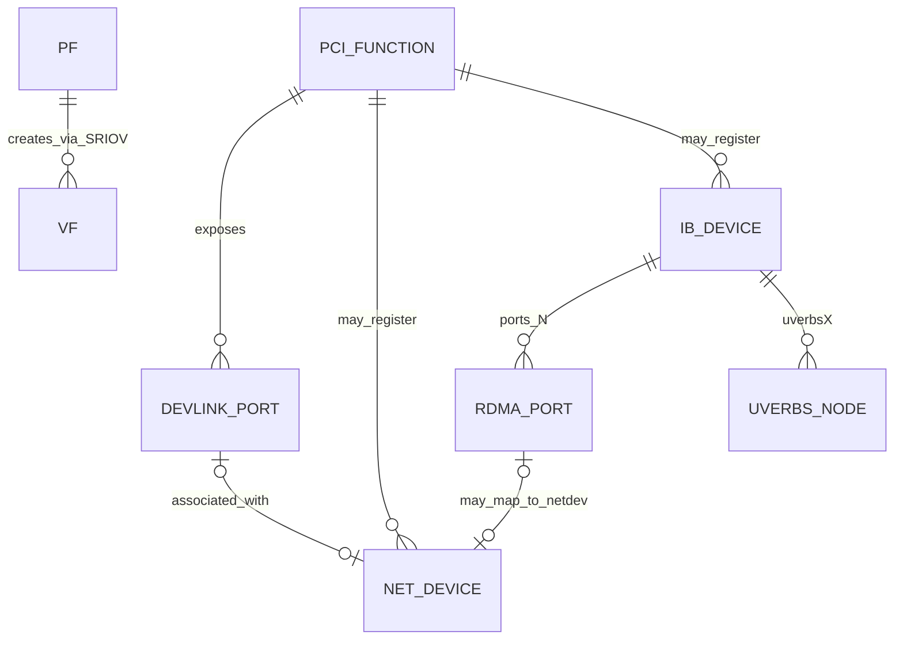

# Organizing Smart NIC, PCIe, NIC, and RDMA Concepts in Linux

## Executive summary

The terms in your notes are not all from one layer. They belong to four different but connected views of the same hardware: the PCIe enumeration view, the Linux networking view, the Linux RDMA view, and the management/control-plane view. A single adapter can therefore appear simultaneously as a PCIe function identified by a BDF such as `0000:03:00.0`, as one or more network interfaces under `/sys/class/net`, as an RDMA device under `/sys/class/infiniband`, and as one or more devlink ports under the `devlink` netlink API. In SR-IOV setups, one Physical Function can spawn multiple Virtual Functions, and in SmartNIC or switchdev mode the same hardware may also expose representor netdevices and devlink port objects. citeturn22view0turn22view2turn22view10turn22view11

The most important organizing principle is this: **a NIC is the packet I/O personality, an RDMA device is the verbs/RDMA personality, a PCIe function is the bus-enumerated hardware endpoint, and devlink is the management topology/control abstraction that helps stitch ports and functions together.** These personalities often share the same underlying PCIe function, but they are represented by different kernel objects: `struct pci_dev`, `struct net_device`, `struct ib_device`, and `struct devlink_port`. On the data path, ordinary socket I/O usually performs user↔kernel copies plus NIC DMA, while RDMA changes the model by requiring memory registration and enabling direct DMA to or from registered user buffers; AF_XDP and `MSG_ZEROCOPY` are important partial exceptions inside the conventional networking stack. citeturn22view5turn22view6turn22view8turn23view3turn22view7turn22view9

One subtle but crucial point is that Linux’s RDMA naming is historically “InfiniBand-shaped,” but the objects are broader than native InfiniBand wire links. `/sys/class/infiniband/<device>` can represent an RDMA-capable device whose per-port `link_layer` is either `Infiniband` or `Ethernet`, and `ibv_devinfo` queries RDMA verbs devices, not only classic InfiniBand host channel adapters. That is why RoCE-capable Ethernet adapters still show up under the Infiniband class and in `ibv_devinfo`. citeturn24view0turn23view12

Kernel version was not specified, so this report describes the stable architecture and the current upstream documentation shape rather than promising one exact call graph for every driver and every release. File locations and helper names are accurate at the subsystem level; where behavior is driver-dependent, that is stated explicitly. citeturn22view1turn22view3turn25view0

## Conceptual layering and terminology

A **NIC** in Linux is primarily the object that sends and receives packets through the networking stack. Its core kernel representation is `struct net_device`, and its userspace manifestation is typically a network interface in `/sys/class/net/<ifname>` and via `ip link`. The transmit entry point for a driver is `ndo_start_xmit()`, NAPI is the standard event-handling/polling mechanism for receive processing, and `struct sk_buff` is the fundamental packet metadata object that moves through the stack. citeturn14search0turn22view4turn22view5turn22view6

A **PCIe function** is the bus-level endpoint enumerated by the PCI subsystem and addressed by `Domain:Bus:Device.Function` (BDF). In SR-IOV, one **Physical Function** (PF) can instantiate multiple **Virtual Functions** (VFs). The kernel PCI SR-IOV documentation defines the PF as the physical device function and the VFs as lightweight virtual PCIe devices that the PF can allocate and control. Sysfs reflects this relationship with `virtfn<N>` links from a PF to its VFs and a `physfn` link from a VF back to its PF. citeturn22view0turn24view1

A **Smart NIC** is not a single special kernel object. In Linux documentation the term is mostly operational: a NIC whose embedded switching and virtualization features are rich enough that the host sees representor netdevices, eswitch mode, and devlink-port-managed virtual or physical ports. In switchdev mode, devlink can expose PF/VF/SF-related ports, and representor netdevices act as the control-plane and slow-path data-plane endpoints for those internal switch ports or virtual functions. citeturn22view10turn22view11turn22view2

An **RDMA device** is the kernel RDMA/verbs personality, represented by `struct ib_device`, exported through the RDMA core and, when userspace verbs are enabled, through the `ib_uverbs` interface. Userspace verbs access is provided by `ib_uverbs`; the kernel documentation explicitly states that `ib_uverbs` enables direct userspace access to IB hardware via verbs, while the `rdma-core` userspace project maps this to device nodes such as `/dev/infiniband/uverbsX` and `/dev/infiniband/rdma_cm`. citeturn23view3turn4search1

The question “**is RDMA a transport, or is it on top of something else?**” is best answered with: **RDMA is a programming/data-movement model implemented by multiple transports.** Native InfiniBand is its own fabric architecture. RoCEv2 places InfiniBand transport headers over UDP/IP on Ethernet, and Linux software RoCE can be instantiated on top of an existing netdev using `rdma link add NAME type rxe netdev NETDEV`. So RDMA is neither “just above the NIC” nor “just a bus object”; it is a transport-capable subsystem that may run over different link layers. citeturn24view0turn23view9turn4search1turn5search26

The table below organizes the terms you listed into the layer where they make the most sense.

| Term | Layer | Kernel object | Sysfs path | Userspace tool | RX/TX relevance |
|---|---|---|---|---|---|
| Smart NIC | Virtualization / embedded switching / management | Usually a combination of `struct pci_dev`, `struct devlink_port`, representor `struct net_device`, and possibly `struct ib_device` | Often visible through PCI, netdev, RDMA, and devlink views together | `devlink`, `ip link`, sometimes `rdma` | Relevant when traffic is steered among PF/VF/SF and representors rather than only host uplink RX/TX. citeturn22view10turn22view11turn22view2 |
| PCIe function | Bus / hardware enumeration | `struct pci_dev` | `/sys/bus/pci/devices/<BDF>` | `lspci`, `readlink`, `ls /sys/bus/pci/devices` | The hardware endpoint that owns BARs, MSI/MSI-X, DMA capability, and often the NIC/RDMA personalities. citeturn24view1turn23view2 |
| PF | PCIe SR-IOV control function | `struct pci_dev` | `/sys/bus/pci/devices/<PF-BDF>` plus `virtfn<N>` | `lspci`, `devlink`, sysfs writes to `sriov_numvfs` | PF usually manages VF creation and often owns eswitch or admin functions. citeturn22view0turn24view1 |
| VF / Virtual Function | PCIe SR-IOV virtual endpoint | `struct pci_dev` | `/sys/bus/pci/devices/<VF-BDF>` plus `physfn` | `lspci`, `devlink`, `ip link` if bound as netdev | VF may carry tenant or guest RX/TX traffic and may have a representor in switchdev setups. citeturn22view0turn24view1turn22view11 |
| NIC | Linux networking data path | `struct net_device`, `struct napi_struct`, `struct sk_buff` | `/sys/class/net/<ifname>` | `ip link`, `ethtool` | This is the ordinary packet RX/TX path object. citeturn14search0turn22view4turn22view5turn24view2 |
| RDMA device | RDMA verbs subsystem | `struct ib_device`, plus `ib_qp`, `ib_cq`, `ib_mr`, `ib_pd` | `/sys/class/infiniband/<dev>`, `/sys/class/infiniband_verbs/uverbs<N>` | `ibv_devinfo`, `rdma link`, `rdma resource` | Relevant for send/recv verbs and RDMA read/write paths that bypass normal socket copies. citeturn24view0turn23view4turn23view12turn23view15 |
| `ibv_devinfo` | Userspace verbs query layer | Queries userspace handles backed by `ib_uverbs` and kernel RDMA objects | Indirectly tied to `/sys/class/infiniband*` and `/dev/infiniband/uverbsX` | `ibv_devinfo` | Shows the verbs view of RDMA-capable devices, not just classical IB fabrics. citeturn23view3turn23view12turn24view0 |
| RDMA as transport/topology | Conceptual transport model | RDMA core plus provider-specific transports | Per-port `link_layer` under `/sys/class/infiniband/<dev>/ports/<n>/link_layer` | `rdma link`, `ibv_devinfo` | Determines whether RDMA is native IB or carried over Ethernet, such as RoCE/rxe. citeturn24view0turn23view9turn5search26 |
| RDMA devices location | Sysfs and character-device exposure | `struct ib_device`, `ib_uverbs` objects | `/sys/class/infiniband`, `/sys/class/infiniband_verbs`, `/dev/infiniband/*` | `ibv_devinfo`, `ibv_devices`, `rdma link` | Where to discover providers, ports, link layers, and the verbs bridge to userspace. citeturn23view4turn23view3turn4search1 |
| `/sys/class/net` devices | Networking class view | `struct net_device` | `/sys/class/net/<ifname>` | `ip link`, `cat`, `readlink` | Houses interface-facing state such as `ifindex`, `mtu`, carrier, queues, and stats. citeturn24view2turn23view7turn23view8 |
| Sysfs paths | ABI surface for discovery/debugging | Many objects across subsystems | `/sys/bus/pci/devices`, `/sys/class/net`, `/sys/class/infiniband`, `/sys/class/infiniband_verbs`, optional `/sys/class/devlink` | shell tools, `udevadm`, `readlink` | Good for correlation and debugging, but direct sysfs traversal should respect the kernel’s sysfs rules. citeturn23view2turn23view7turn23view4turn23view5turn25view0 |

## Kernel objects and sysfs topology

The cleanest mental model is to think of one adapter as being **projected into multiple kernel subsystems**. The PCI subsystem owns the bus identity and DMA-capable hardware endpoint. The networking subsystem turns some functions or ports into `struct net_device` instances. The RDMA subsystem turns some functions or ports into `struct ib_device` instances. The devlink subsystem adds a management-oriented port/function topology, especially important for switchdev, SmartNIC, PF/VF, and port-flavour relationships. citeturn22view2turn22view10turn22view11turn23view3

A useful rule of thumb is that **`/sys/class/net` answers “what packet interfaces do I have?”**, while **`/sys/class/infiniband` answers “what RDMA verbs devices and ports do I have?”**. These are not mutually exclusive. A RoCE-capable Ethernet adapter may have a normal network interface under `/sys/class/net` and an RDMA device under `/sys/class/infiniband`, with the RDMA port’s `link_layer` reporting `Ethernet`. That historical naming asymmetry is expected and is one reason people get confused when `ibv_devinfo` lists a device on an Ethernet-based system. citeturn24view0turn23view12

For sysfs, the most important locations are these. PCI devices are rooted at `/sys/bus/pci/devices/<BDF>`. Network interfaces live in `/sys/class/net/<ifname>`, which exposes attributes such as `ifindex`, `iflink`, `mtu`, `carrier`, `operstate`, `dev_port`, and queue/statistics subdirectories. RDMA devices live in `/sys/class/infiniband/<device>` with per-port state and counters. The verbs bridge is visible in `/sys/class/infiniband_verbs/uverbs<N>/ibdev`, which tells you which RDMA device a given `uverbs` node belongs to. Devlink also has a sysfs class in current ABI documentation under `/sys/class/devlink/...`, but the primary operational interface remains the `devlink` netlink userspace tool rather than sysfs. citeturn23view2turn24view2turn23view7turn23view8turn24view0turn23view4turn23view5turn23view13

One nuance matters for rigorous tooling: the kernel’s sysfs rules explicitly warn against depending on class-device `device` symlinks as stable ABI elements. For ad hoc debugging, `readlink -f /sys/class/net/<ifname>` and similar commands are fine. For robust software, however, the kernel advises resolving real device paths under `/sys/devices` and walking by subsystem semantics rather than hard-coding `/sys/class/net/<ifname>/device/...` paths as if they were permanent ABI structure. citeturn25view0

The relationship among the major objects can be sketched as follows.



The kernel-object correspondence is also why the names in your list should not be flattened into one taxonomy. `struct net_device` is not “the same thing” as `struct ib_device`. `ib_uverbs` is not “the RDMA device”; it is the userspace verbs bridge. And devlink is not a packet datapath object at all; it is the management/control abstraction whose ports can be typed as `eth`, `ib`, or `auto`, and flavoured as physical, PF, VF, SF, and so on. citeturn22view2turn23view3turn23view10

## Userspace tools and cross-layer correlation

The fastest way to stitch the layers together is to remember what each tool is actually asking the kernel. `ip link` inspects network interfaces. `ibv_devinfo` queries verbs/RDMA devices. `rdma link show` inspects RDMA links/ports and can also instantiate software RDMA over a netdev for `rxe`. `rdma resource show` exposes tracked RDMA resources such as `cq`, `mr`, `pd`, `qp`, `ctx`, and `srq`. `devlink port show` reveals management/topology ports with port flavour and type, and `devlink dev show` gives the devlink device handle, typically keyed by the PCI BDF. citeturn23view11turn23view12turn23view9turn23view15turn23view10turn23view13

A practical discovery sequence for one physical adapter is usually:

1. Find the PCIe function: `ls /sys/bus/pci/devices` or `lspci`.
2. Ask whether it registered a netdev: `ls /sys/bus/pci/devices/<BDF>/net`.
3. Ask whether it registered an RDMA device: `ls /sys/class/infiniband` and inspect `/sys/class/infiniband_verbs/uverbs*/ibdev`.
4. Ask whether it participates in devlink topology: `devlink dev show` and `devlink port show`.
5. Ask whether the RDMA port is InfiniBand or Ethernet: `cat /sys/class/infiniband/<dev>/ports/<n>/link_layer`.
6. Ask whether there are SR-IOV relationships: inspect `virtfn<N>`, `physfn`, and `sriov_numvfs`. citeturn24view1turn23view4turn24view0turn23view10turn23view13turn3search5

Illustrative commands:

```bash
# Start from a netdev
ip link show dev ens2f0
readlink -f /sys/class/net/ens2f0
ls /sys/class/net/ens2f0/queues
ls /sys/class/net/ens2f0/statistics

# Correlate to PCI
readlink -f /sys/class/net/ens2f0   # resolve to the real devpath under /sys/devices
ls /sys/bus/pci/devices/0000:03:00.0/net

# Correlate to RDMA
ls /sys/class/infiniband
cat /sys/class/infiniband_verbs/uverbs0/ibdev
cat /sys/class/infiniband/mlx5_0/ports/1/link_layer
ibv_devinfo
rdma link show
rdma resource show

# Correlate to devlink
devlink dev show
devlink port show
devlink dev eswitch show pci/0000:03:00.0
```

A synthetic correlation example on a RoCE-capable Ethernet adapter could look like this:

```text
PCI function:
  /sys/bus/pci/devices/0000:03:00.0

Netdevs registered by that PCI function:
  /sys/bus/pci/devices/0000:03:00.0/net/ens2f0

RDMA device:
  /sys/class/infiniband/mlx5_0
  /sys/class/infiniband_verbs/uverbs0/ibdev -> mlx5_0

Per-port link layer:
  /sys/class/infiniband/mlx5_0/ports/1/link_layer = Ethernet

Devlink:
  pci/0000:03:00.0/1: type eth netdev ens2f0 flavour physical
```

The important analytical lesson is that **the same adapter is visible through multiple namespaces at once**. `ibv_devinfo` does not replace `ip link`; it complements it. `devlink port show` often tells you which topological port or VF a netdev corresponds to, while `/sys/class/infiniband_verbs/uverbs<N>/ibdev` tells you which verbs device a given userspace interface is attached to. citeturn23view12turn23view9turn23view15turn23view10turn23view4

## RX and TX kernel paths and where copies occur

For an ordinary Ethernet/TCP/UDP **RX path**, the typical sequence is: the NIC receives a frame and DMAs it into host memory buffers that the driver prepared; the device raises an interrupt or completion event; the driver schedules a NAPI instance; NAPI polling cleans RX descriptors and turns received buffers into `sk_buff` instances or skb fragments; the packet is handed upward through GRO and `netif_receive_skb()` or related receive helpers; the protocol stack processes it and eventually queues data for a socket; then `recv()`/`read()` copies data into a user buffer. NAPI documentation, the netdevice driver documentation, and the `netif_receive_skb()` API text all describe the interrupt→NAPI→softirq receive progression. citeturn22view4turn22view6turn14search0turn18search1

For an ordinary **TX path**, a userspace call such as `send()` or `write()` gives the kernel a user buffer to transmit. In the conventional socket path, the kernel prepares packet buffers (`skb`s), routes them through protocol processing and queueing, and reaches the driver’s `ndo_start_xmit()` callback. The driver maps packet memory for DMA with the DMA API, fills TX descriptors in the ring, rings the device doorbell, and the NIC DMA-reads the packet data for transmission. When hardware completes TX, the driver processes the completion, unmaps DMA mappings, and frees or recycles the skb. The network driver documentation defines `ndo_start_xmit()` as the transmit entry point, and the DMA API documentation explains that `dma_map_single()` creates a device-visible DMA address from CPU memory rather than performing a CPU `memcpy()`. citeturn14search0turn14search1turn22view8turn10search2

The key question you asked—**where does data copy actually happen?**—has a layered answer.

First, **DMA is movement, but not usually a CPU copy**. When the NIC writes RX data into host memory or reads TX data from host memory, the device is transferring bytes over PCIe using DMA. The kernel DMA API exists precisely because CPU virtual addresses, physical addresses, and device DMA addresses may differ, especially with an IOMMU. So `dma_map_single()` / `dma_unmap_single()` should be understood as addressability/mapping operations around device transfers, not as `memcpy()` equivalents. citeturn22view8turn10search2

Second, in the **ordinary socket TX path**, the main CPU copy is typically **user → kernel**. The MSG_ZEROCOPY documentation says Linux supports several copy-avoidance interfaces because copying large buffers between user process and kernel is expensive, and `MSG_ZEROCOPY` extends copy avoidance to common socket sends. That wording implies the baseline case: ordinary socket send paths normally copy user data into kernel-owned transmit buffers or skb-backed memory before the driver DMA-maps and transmits it. citeturn22view7turn15search2turn15search13

Third, in the **ordinary socket RX path**, there is usually a **kernel → user** copy at `recv()` / `read()` time. Before that, the NIC has already DMA-written bytes into host buffers and the driver or stack has wrapped them in skb structures. The man pages describe `recv()` and `read()` as receiving data into a user-provided buffer, and Linux’s packet and mmap exceptions exist precisely because they avoid or alter this standard copy behavior. citeturn15search5turn15search19turn15search0

Fourth, there may also be **driver-internal copies** on RX or TX. These are not universal, but they are common enough that a rigorous mental model must include them. The ENA driver documentation gives a good canonical example: on RX, small packets may be copied into a new skb when below `rx_copybreak`, while larger packets may reuse or attach page-backed buffers as skb linear data and frags. That means the number of copies on receive is partly a driver policy choice, not just a property of “the Linux network stack” in the abstract. citeturn13search2

The normal-path flow can be summarized like this.

```mermaid
flowchart TB
  subgraph RX
    R1[Wire] --> R2[NIC RX queue]
    R2 --> R3[DMA into host RX buffers]
    R3 --> R4[IRQ or completion event]
    R4 --> R5[NAPI scheduled]
    R5 --> R6[Driver poll cleans RX descriptors]
    R6 --> R7[Build skb or attach page frags]
    R7 --> R8[GRO and netif_receive_skb()]
    R8 --> R9[Protocol stack]
    R9 --> R10[Socket receive queue]
    R10 --> R11[copy to userspace on recv/read]
  end

  subgraph TX
    T1[send/write from userspace] --> T2[user to kernel copy in ordinary socket path]
    T2 --> T3[Protocol stack and queueing]
    T3 --> T4[Driver ndo_start_xmit()]
    T4 --> T5[dma_map_single or dma_map_sg]
    T5 --> T6[TX descriptor ring and doorbell]
    T6 --> T7[NIC DMA reads packet]
    T7 --> T8[Wire]
    T7 --> T9[TX completion]
    T9 --> T10[dma_unmap and free/recycle skb]
  end
```

Two important exceptions sit inside the ordinary Linux networking world. **AF_XDP** has both copy and zero-copy modes; the kernel documentation explicitly says that in AF_XDP copy mode the XSK core copies data into descriptors, while in zero-copy mode the data is not copied. **`MSG_ZEROCOPY`** is copy avoidance for socket send calls, but it still stays within the conventional socket stack and uses page pinning plus completion notifications; it is not equivalent to verbs RDMA. citeturn22view9turn11search3turn22view7

## How RDMA changes the copy model

RDMA changes the model because the application must **register memory** before the hardware can use it as a data-transfer target or source. `ibv_reg_mr()` registers a memory region associated with a protection domain, and the RDMA CM helper calls such as `rdma_reg_msgs`, `rdma_reg_read`, `rdma_post_send`, and `rdma_post_recv` all require that the buffers be registered and remain registered until the operation completes. In the kernel, this registration is not “just a pointer”; it is tracked memory with device-facing metadata, and upstream kernel headers expose this layer through structures such as `ib_umem`, which contains fields including `owning_mm`, `iova`, `length`, and scatter-gather state. citeturn16search2turn16search1turn16search5turn16search10turn17search16

This has two direct consequences. First, **the usual user↔kernel payload copy can disappear** for the actual data transfer. In send/recv verbs, the NIC can DMA directly to or from registered application buffers instead of requiring the kernel to copy the payload into temporary socket buffers. Second, for **RDMA Read/Write**, the remote side can access registered memory directly: `rdma_reg_read` documents buffers that are targets of remote RDMA reads, and the RDMA CM/verbs interfaces provide explicit remote read and write operations rather than only message sends. citeturn16search12turn16search3turn16search1

That does **not** mean “the kernel disappears.” The kernel still owns connection setup, protection domains, queue pairs, completion queues, memory registration metadata, and the userspace ABI bridge. The user-verbs documentation explains that `ib_uverbs` enables direct userspace access to hardware while keeping resource creation and destruction tied to a file descriptor and opaque handles so that kernel pointers are never exposed directly. RDMA therefore removes payload copies from the steady-state data path, but it does so through more explicit kernel-mediated setup and resource management, not by bypassing kernel control entirely. citeturn23view3turn4search1

A concise way to compare the models is:

- **Ordinary sockets**: deploy generic kernel networking, usually copy user payload into kernel-managed transmit/receive buffers, then use NIC DMA. citeturn22view7turn22view8turn15search5
- **MSG_ZEROCOPY**: keep the socket stack but avoid some TX copies via page pinning and completion notifications; still not a verbs/RDMA model. citeturn22view7
- **AF_XDP zero-copy**: bypass much of the skb/socket path for selected queues and share UMEM-backed buffers with driver/XDP path. citeturn22view9turn11search3
- **RDMA verbs**: register memory, post work requests to QPs, and let the NIC DMA directly to/from registered user buffers, with completions delivered through CQs instead of socket semantics. citeturn16search2turn16search5turn16search10turn23view15

## Kernel source map and trace targets

The kernel source map below focuses on the objects and entry points you explicitly asked about. Where current upstream documentation or source-search results clearly expose the location, the path is listed directly. Where behavior is implementation-specific, the subsystem is listed instead.

| Struct / function | Role | Where in kernel source | Why it matters |
|---|---|---|---|
| `struct net_device` | Core Linux network interface object | `include/linux/netdevice.h` citeturn8search2turn22view1 | The NIC-facing object visible in `/sys/class/net` and used by `ip link`. |
| `struct napi_struct` | Receive polling/event object | `include/linux/netdevice.h` citeturn17search1turn22view4 | Connects interrupt moderation and softirq polling on RX. |
| `ndo_start_xmit()` | Driver TX entry point | `struct net_device_ops` in `include/linux/netdevice.h`; semantics documented in netdevice docs citeturn14search0turn8search5 | The driver callback that queues packets to hardware. |
| `struct sk_buff` | Packet metadata object | `include/linux/skbuff.h` and docs in `networking/skbuff.rst` citeturn22view5 | Central packet object in the conventional networking stack. |
| `netif_receive_skb()` | Main receive processing handoff | `net/core/dev.c` citeturn22view6turn8search19 | Main “packet enters upper stack” receive path. |
| `__napi_schedule()` / NAPI poll path | NAPI scheduling into softirq | networking core docs refer to NAPI scheduling; implementation in net core (`net/core/dev.c`) citeturn22view6turn22view4 | The hinge between IRQ/completion and batched RX processing. |
| `struct ib_device` | RDMA core device object | `include/rdma/ib_verbs.h` citeturn17search0 | The RDMA verbs personality of the adapter. |
| `ib_register_device()` | RDMA device registration into core | `drivers/infiniband/core/device.c` and RDMA core docs citeturn8search0turn8search15 | Called by low-level RDMA drivers to publish an RDMA device. |
| `struct ib_qp`, `struct ib_cq`, `struct ib_mr`, `struct ib_pd` | Kernel RDMA queue pair, completion queue, memory region, protection domain | RDMA verbs headers/subsystem, primarily `include/rdma/ib_verbs.h` citeturn17search0turn23view15 | Kernel-side counterparts to the userspace verbs resources you inspect with `rdma resource show`. |
| `ib_uverbs` / userspace verbs bridge | Userspace ABI for verbs | `drivers/infiniband/core/uverbs_main.c` citeturn17search3turn23view3 | Bridges `/dev/infiniband/uverbsX` to kernel RDMA objects. |
| `struct ib_umem` | Registered userspace memory tracking | `include/rdma/ib_umem.h` citeturn17search16 | The kernel object that makes an MR more than “just a pointer.” |
| `struct devlink_port` | Management/topology port object | `include/net/devlink.h` and devlink-port docs citeturn17search2turn22view2 | Connects port flavour/type and management topology to netdev/IB views. |
| `dma_map_single()` / `dma_unmap_single()` | DMA address mapping API | DMA mapping API headers/subsystem, documented in DMA API docs citeturn22view8turn10search2 | Marks where buffers become device-addressable for RX/TX DMA. |
| `napi_poll` tracepoint | RX poll tracepoint | `include/trace/events/napi.h` citeturn17search5 | Useful for tracing RX poll budget and activity. |
| `net_dev_start_xmit`, `net_dev_queue`, `netif_receive_skb*` tracepoints | Networking tracepoints | `include/trace/events/net.h` citeturn19search0 | Useful for tracing packet movement around TX enqueue and RX handoff. |

If you want to trace a real system, the highest-value observation points are usually these: `napi_poll` for receive batching, `netif_receive_skb()` for the packet handoff into upper receive processing, `ndo_start_xmit()` or its driver-specific implementation for transmit submission, DMA-map/unmap sites in the driver for buffer ownership transfer, and RDMA registration/posting points such as `ib_register_device()` during bring-up and QP/CQ/MR creation paths during verbs use. The source tree also provides purpose-built tracepoints for `napi_poll` and for packet entry/queue/transmit events in the net trace event headers. citeturn17search5turn19search0turn22view6turn22view8turn8search15

The last conceptual bridge worth remembering is this: **devlink is especially good for understanding port/function topology; netdev is especially good for packet interfaces; RDMA core is especially good for verbs-capable devices and memory-registration semantics; PCI is especially good for hardware identity and DMA ownership.** If you keep those namespaces separate, the whole stack becomes much easier to reason about. citeturn22view2turn23view11turn23view12turn24view1